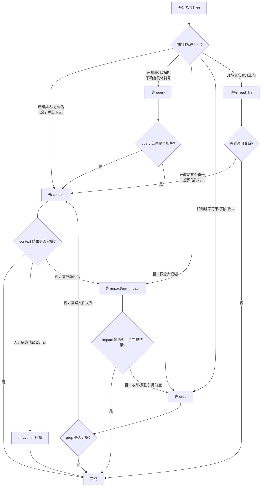

# GitNexus MCP 使用指导（基于 bk-monitor 仓库实战）

> **核心结论**：GitNexus 适合"结构化理解"和"改动评估"，grep 适合"精确定位"和"实现确认"，最优策略是混合使用。

***

## 目录

- [一、GitNexus 是什么](#一gitnexus-是什么)
- [二、工具清单与核心用途](#二工具清单与核心用途)
- [三、每个工具的详细使用方式与适用场景](#三每个工具的详细使用方式与适用场景)
  - [3.1 query — 概念级代码检索](#31-query--概念级代码检索)
  - [3.2 context — 符号级精准引用视图（⭐ 最常用）](#32-context--符号级精准引用视图-最常用)
  - [3.3 impact — 改动影响面分析（⭐ 改动前必用）](#33-impact--改动影响面分析-改动前必用)
  - [3.4 cypher — 自定义图查询（⭐ 最灵活）](#34-cypher--自定义图查询-最灵活)
  - [3.5 route_map / shape_check / tool_map — API 专属工具](#35-route_map--shape_check--tool_map--api-专属工具)
  - [3.6 detect_changes — 未提交变更分析](#36-detect_changes--未提交变更分析)
  - [3.7 rename — 多文件协同重命名](#37-rename--多文件协同重命名)
  - [3.8 api_impact — API 路由处理器预变更影响报告](#38-api_impact--api-路由处理器预变更影响报告)
  - [3.9 list_repos / group_list / group_sync — 仓库与组管理](#39-list_repos--group_list--group_sync--仓库与组管理)
- [四、GitNexus vs 传统 grep/文本搜索 — 核心差异](#四gitnexus-vs-传统-grep文本搜索--核心差异)
- [五、决策树：什么时候用什么？](#五决策树什么时候用什么)
- [六、实战案例详解](#六实战案例详解)
  - [6.1 案例1：探索 Resource 类的完整依赖关系](#61-案例1探索-resource-类的完整依赖关系)
  - [6.2 案例2：评估 Handler 类的变更影响面](#62-案例2评估-handler-类的变更影响面)
  - [6.3 案例3：追踪方法内部的调用链](#63-案例3追踪方法内部的调用链)
  - [6.4 案例4：查找枚举常量的引用（grep 更优）](#64-案例4查找枚举常量的引用grep-更优)
  - [6.5 案例5：提交前变更风险评估](#65-案例5提交前变更风险评估)
  - [6.6 案例6：安全地跨文件重命名](#66-案例6安全地跨文件重命名)
- [七、最佳实践总结](#七最佳实践总结)
- [八、注意事项与局限性](#八注意事项与局限性)

***

## 一、GitNexus 是什么

GitNexus 是一个**代码知识图谱 MCP 服务**，它在代码仓库上构建结构化的符号索引和关系图谱，通过 `query`、`context`、`impact`、`cypher` 等工具提供**语义化的代码探索和变更影响分析**能力。

**核心价值**：把代码中的"关系"（谁调用谁、谁继承谁、谁导入谁）变成**可查询、可度量、可追踪**的结构化数据，而非散落在文件中的文本。

**与 grep 的本质区别**：
- grep 回答的是"**哪里出现了这个字符串？**"——扁平的文本匹配
- GitNexus 回答的是"**谁依赖了它？它依赖谁？改了它会影响什么？**"——结构化的关系理解

**前提条件**：使用前需要用 `gitnexus analyze` 对仓库建立索引。没有索引 = 无法使用任何 GitNexus 工具。

***

## 二、工具清单与核心用途

| 工具 | 核心能力 | 最佳场景 | 推荐度 |
|------|---------|---------|-------|
| **`context`** | 符号上下文：单个类/函数/变量的360°引用视图 | 已知符号名，想看谁用它、它用什么、它属于谁 | ⭐⭐⭐ |
| **`impact`** | 影响面分析：改动某个符号后的波及范围 | **改动前评估**，看哪些模块/流程会受影响 | ⭐⭐⭐ |
| **`cypher`** | 图查询：自定义 Cypher 查询访问知识图谱 | 需要精确控制查询逻辑，或组合多种关系类型 | ⭐⭐⭐ |
| **`query`** | 概念检索：搜索执行流、符号定义和相关模块 | 不确定具体符号名，想按概念/功能找代码 | ⭐⭐ |
| **`rename`** | 多文件协同重命名 | 安全地跨文件重命名符号 | ⭐⭐ |
| **`detect_changes`** | 未提交变更分析：改动→受影响符号→受影响流程 | 提交前评审 | ⭐⭐ |
| **`api_impact`** | API 路由处理器的预变更影响报告 | 修改 API handler 之前评估影响 | ⭐⭐ |
| **`route_map`** | API 路由映射：端点→处理器→消费者 | 理解 HTTP API 的前后端对应关系 | ⭐ |
| **`shape_check`** | 响应形状检查：API 返回字段 vs 消费者字段访问 | 检测接口契约不匹配（shape drift） | ⭐ |
| **`tool_map`** | MCP/RPC 工具定义映射 | 了解哪些工具被定义在哪里 | ⭐ |
| **`list_repos`** | 列出所有已索引仓库 | 确认仓库索引状态 | 辅助 |
| **`group_list`** | 列出仓库组 | 多仓库管理 | 辅助 |
| **`group_sync`** | 提取契约并跨仓库匹配 | 微服务间接口对齐 | 辅助 |

***

## 三、每个工具的详细使用方式与适用场景

### 3.1 `query` — 概念级代码检索

**何时使用**：你有一个模糊的概念或关键词，想找相关的执行流、符号和文件，但不确定精确的类名或函数名。

**参数说明**：

| 参数 | 类型 | 必填 | 说明 |
|------|------|------|------|
| `query` | string | ✅ | 搜索关键词 |
| `goal` | string | ❌ | 搜索目的，帮助排名 |
| `task_context` | string | ❌ | 当前工作上下文，帮助排名 |
| `repo` | string | ❌ | 仓库名（仅一个仓库时可省略） |
| `limit` | number | ❌ | 最大返回进程数（默认5） |
| `max_symbols` | number | ❌ | 每个进程最大符号数（默认10） |
| `include_content` | boolean | ❌ | 是否包含符号源码（默认false） |

**使用示例**：

```json
{
  "query": "SearchAlertResource alert resource query",
  "goal": "find Resource classes related to alert search",
  "task_context": "exploring gitnexus capabilities on Resource classes",
  "limit": 5,
  "max_symbols": 10
}
```

**返回内容**：按执行流（process）组织的符号列表，每个流程包含相关符号和文件位置，基于 BM25 + 语义向量的混合排名。

**局限与风险**（实测发现）：

1. **概念检索不稳定**——同一个查询可能返回质量参差的结果
2. **关键词不够具体时**容易混入大量无关定义（如测试文件、JS 编译产物）
3. **不适合**作为精确查找的第一选择——如果你知道确切的类名，应该直接用 `context`

**推荐策略**：
- ✅ **首选**：当你只知道自己想找的"功能概念"时
- ⚠️ **次选**：当你已知具体类名/函数名时，跳过 `query`，直接用 `context`
- ❌ **不推荐**：用于查找精确的字符串或字段名——用 `grep` 更快更准

---

### 3.2 `context` — 符号级精准引用视图 ⭐ 最常用

**何时使用**：你已知一个类名、方法名、变量名（比如 `SearchAlertResource`、`AlertQueryHandler.search`、`VIEW_EVENT`），想快速了解它的完整上下文。

**参数说明**：

| 参数 | 类型 | 必填 | 说明 |
|------|------|------|------|
| `name` | string | ❌ | 符号名称（与 uid 二选一） |
| `uid` | string | ❌ | 符号 UID（零歧义，来自之前的查询结果） |
| `repo` | string | ❌ | 仓库名 |
| `kind` | string | ❌ | 类型过滤（Class/Method/Function/Interface 等） |
| `file_path` | string | ❌ | 文件路径（消歧用） |
| `include_content` | boolean | ❌ | 是否包含源码（默认false） |

**使用方式**：

```json
// 方式1：按名称查（需提供足够消歧信息）
{"name": "SearchAlertResource", "kind": "Class", "file_path": "bkmonitor/packages/fta_web/alert/resources.py"}

// 方式2：按 UID 查（零歧义，来自之前的查询结果）
{"uid": "Class:bkmonitor/packages/fta_web/alert/resources.py:SearchAlertResource"}

// 方式3：查方法级
{"name": "search", "kind": "Method", "file_path": "bkmonitor/packages/fta_web/alert/handlers/alert.py"}
```

**返回内容**：

- **incoming（谁依赖它）**：imports（哪些文件 import 了它）、calls（谁调用了它）
- **outgoing（它依赖什么）**：has_method（它的方法）、extends（它继承谁）、implements（它实现谁）
- **processes（它参与的执行流）**：哪些业务流程中有这个符号

**实测效果**（以 `SearchAlertResource` 为例）：

| 项目 | 结果 |
|------|------|
| import 了它的文件 | ✅ 精确列出 4 个文件 |
| 它的方法 | ✅ 列出 4 个：`perform_request`、`detect_action_id_query`、`adjust_time_range_for_action_id`、`replace_time_for_alert_id` |
| 继承关系 | ✅ 指出继承自 `Resource` 基类 |
| 方法内部调用链 | ❌ 不包含（需要用 `cypher` 补充） |

**消歧问题**（实测发现）：

当查询 `perform_request` 这种常见方法名时，`context` 会返回 **"ambiguous"** 状态并列出多个候选方法。此时**必须**提供 `file_path` 或 `uid` 来消歧。

**推荐策略**：
- ✅ **首选**：已知符号名时，这是最精准的工具
- ✅ **首选**：需要了解"谁依赖这个类"时
- ⚠️ **次选**：当符号名太常见（如 `perform_request`）时，需要额外提供 `file_path` 或 `uid`
- ❌ **不推荐**：用于查找枚举常量的引用（如 `ActionEnum.VIEW_EVENT`）——用 `grep` 更全

---

### 3.3 `impact` — 改动影响面分析 ⭐ 改动前必用

**何时使用**：你打算修改某个类/方法/变量，想提前知道改动会波及哪些模块和流程。

**参数说明**：

| 参数 | 类型 | 必填 | 说明 |
|------|------|------|------|
| `target` | string | ✅ | 目标符号名称 |
| `direction` | string | ✅ | `upstream`（谁依赖我）/ `downstream`（我依赖谁） |
| `repo` | string | ❌ | 仓库名 |
| `kind` | string | ❌ | 类型过滤（Class/Method 等） |
| `file_path` | string | ❌ | 文件路径（消歧用） |
| `maxDepth` | number | ❌ | 最大追踪深度（默认3） |
| `minConfidence` | number | ❌ | 最低置信度过滤（0-1） |
| `relationTypes` | array | ❌ | 关系类型过滤 |
| `includeTests` | boolean | ❌ | 是否包含测试代码 |

**使用示例**：

```json
{
  "target": "AlertQueryHandler",
  "direction": "upstream",
  "kind": "Class",
  "maxDepth": 2,
  "includeTests": false
}
```

**返回内容**：

- **risk**: LOW / MEDIUM / HIGH / CRITICAL
- **byDepth**: 按深度分组的影响面
  - d=1（WILL BREAK）：直接依赖，一定会受影响
  - d=2（LIKELY AFFECTED）：间接依赖，大概率受影响
  - d=3（POSSIBLY AFFECTED）：更深层依赖，可能有影响
- **affected_processes**: 受影响的执行流
- **affected_modules**: 受影响的功能模块

**实测效果**：

| 查询目标 | 结果 | 评价 |
|---------|------|------|
| `SearchAlertResource` 上游 | 3 个直接 import 了它的文件，风险 LOW | ✅ 类级符号效果好 |
| `AlertQueryHandler` 上游 | 11 个直接依赖（d=1），16 个间接依赖（d=2），6 个更深层（d=3），风险 MEDIUM | ✅ 信息非常丰富 |
| `VIEW_EVENT` 属性查询 | 返回空 | ❌ 枚举常量的引用不属于标准关系类型 |
| `AlertQueryHandler.search` 方法查询 | "Target not found" | ❌ 方法级节点可能未单独建立 |

**推荐策略**：
- ✅ **首选**：修改 Resource 类、Handler 类等**类级符号**之前
- ⚠️ **次选**：对枚举常量、属性访问型引用，`impact` 覆盖不全，需配合 `grep`
- ❌ **不推荐**：对方法级符号做影响面分析（不稳定）

---

### 3.4 `cypher` — 自定义图查询 ⭐ 最灵活

**何时使用**：`query`/`context`/`impact` 无法满足需求时，你需要自定义 Cypher 查询来组合多种关系和过滤条件。

**参数说明**：

| 参数 | 类型 | 必填 | 说明 |
|------|------|------|------|
| `query` | string | ✅ | Cypher 查询语句 |
| `repo` | string | ❌ | 仓库名 |

**图谱 Schema 速查**：

**节点类型**：File, Folder, Function, Class, Interface, Method, CodeElement, Community, Process, Route, Tool

**边类型（通过 CodeRelation 表的 type 属性过滤）**：

| 边类型 | 说明 |
|--------|------|
| CONTAINS | 文件/文件夹包含关系 |
| DEFINES | 文件定义了某个符号 |
| CALLS | 函数/方法调用 |
| IMPORTS | 导入关系 |
| EXTENDS | 类继承 |
| IMPLEMENTS | 接口实现 |
| HAS_METHOD | 类拥有方法 |
| HAS_PROPERTY | 类拥有属性 |
| ACCESSES | 属性访问（read/write） |
| METHOD_OVERRIDES | 方法重写 |
| METHOD_IMPLEMENTS | 方法实现 |
| MEMBER_OF | 属于某个功能社区 |
| STEP_IN_PROCESS | 执行流的步骤 |
| HANDLES_ROUTE | 处理路由 |
| FETCHES | 前端消费 API |
| HANDLES_TOOL | 处理工具 |
| ENTRY_POINT_OF | 入口点 |

**常用查询示例**：

```cypher
-- 1. 查找类的所有方法
MATCH (c:Class {name: 'SearchAlertResource'})-[r:CodeRelation {type: 'HAS_METHOD'}]->(m:Method)
RETURN c.name, m.name, m.filePath ORDER BY m.name

-- 2. 查找谁调用了某个方法
MATCH (f)-[r:CodeRelation {type: 'CALLS'}]->(m:Method {name: 'search'})
    <-[:CodeRelation {type: 'HAS_METHOD'}]-(c:Class {name: 'AlertQueryHandler'})
RETURN f.name, f.filePath, r.type LIMIT 20

-- 3. 查找方法调用的下游
MATCH (m:Method)-[r:CodeRelation {type: 'CALLS'}]->(target)
WHERE m.filePath = 'bkmonitor/packages/fta_web/alert/resources.py' AND m.name = 'perform_request'
RETURN m.name, target.name, target.filePath, r.type LIMIT 30

-- 4. 查找最"被依赖"的符号（热点代码）
MATCH (n)<-[r:CodeRelation {type: 'CALLS'}]-(caller)
RETURN n.name, n.filePath, count(caller) AS callerCount
ORDER BY callerCount DESC LIMIT 10

-- 5. 查找继承关系
MATCH (d:Class)-[:CodeRelation {type: 'EXTENDS'}]->(b)
RETURN d.name, d.filePath, b.name, b.filePath

-- 6. 查找某个社区的所有成员
MATCH (f)-[:CodeRelation {type: 'MEMBER_OF'}]->(c:Community)
WHERE c.heuristicLabel = 'Handlers'
RETURN f.name, f.filePath

-- 7. 追踪执行流
MATCH (s)-[r:CodeRelation {type: 'STEP_IN_PROCESS'}]->(p:Process)
WHERE p.heuristicLabel = 'AlertSearch'
RETURN s.name, r.step ORDER BY r.step
```

**实测效果**：

| 查询 | 结果 | 评价 |
|------|------|------|
| `SearchAlertResource` 的方法 | 精准返回 4 个方法 | ✅ 非常准确 |
| 谁调用了 `AlertQueryHandler.search` | 找到 2 个 `perform_request` | ✅ 精确定位 |
| `EditDataMeaningResource.perform_request` 下游调用 | 30 行调用链结果 | ✅ 信息非常丰富 |

**推荐策略**：
- ✅ **首选**：当 `context`/`impact` 的结果不够详细或需要自定义关系过滤时
- ✅ **首选**：追踪方法内部的调用链（`context` 只提供类级引用，`cypher` 可深入方法级）
- ⚠️ **注意**：需要了解图谱的 schema 和标签体系
- ❌ **不推荐**：简单场景下使用（杀鸡用牛刀，不如直接用 `context`）

---

### 3.5 `route_map` / `shape_check` / `tool_map` — API 专属工具

**何时使用**：

- `route_map`：理解 HTTP API 的前后端对应关系（端点→处理器→消费者）
- `shape_check`：检测接口返回字段与消费者期望字段的匹配情况
- `tool_map`：查看 MCP/RPC 工具的定义和处理器位置

**参数说明**：

| 工具 | 参数 | 说明 |
|------|------|------|
| `route_map` | `repo`, `route`（可选） | 按路由路径过滤或列出所有路由 |
| `shape_check` | `repo`, `route`（可选） | 按路由路径检查或检查所有路由 |
| `tool_map` | `repo`, `tool`（可选） | 按工具名过滤或列出所有工具 |

**实测效果**（在 bk-monitor 仓库中）：

| 工具 | 结果 | 原因 |
|------|------|------|
| `route_map` | 全是测试文件中的引用关系 | bk-monitor 使用 DRF Resource 框架，不是标准 Express/Fastify 路由 |
| `shape_check` | 返回空 | 索引中没有 API 响应形状数据 |
| `tool_map` | 返回空 | bk-monitor 不定义 MCP 工具 |

**推荐策略**：
- ⚠️ 这三个工具在**纯后端仓库（如 bk-monitor 的 DRF 架构）**中可能无法使用
- ✅ 如果你的仓库使用标准前端框架（React/Next.js + API Routes），这些工具会很有用
- ❌ 不建议在索引不全的仓库中依赖这些工具

---

### 3.6 `detect_changes` — 未提交变更分析

**何时使用**：提交代码之前，想快速了解自己的改动影响了哪些符号和流程。

**参数说明**：

| 参数 | 类型 | 必填 | 说明 |
|------|------|------|------|
| `repo` | string | ❌ | 仓库名 |
| `scope` | string | ❌ | `unstaged`（默认）/ `staged` / `all` / `compare` |
| `base_ref` | string | ❌ | 当 scope=compare 时的基准分支 |

**使用示例**：

```json
{"repo": "bk-monitor", "scope": "all"}
```

**返回内容**：
- `summary`: changed_count、affected_count、risk_level
- `changed_symbols`: 被改动的符号列表
- `affected_processes`: 受影响的执行流列表

**推荐策略**：
- ✅ 提交前评审：先 `detect_changes`，再对高风险符号用 `context` 深入分析
- ✅ PR 准备：配合 `impact` 使用更全面

---

### 3.7 `rename` — 多文件协同重命名

**何时使用**：需要安全地在多个文件中重命名一个类、方法或变量。

**参数说明**：

| 参数 | 类型 | 必填 | 说明 |
|------|------|------|------|
| `symbol_name` | string | ❌ | 当前符号名 |
| `symbol_uid` | string | ❌ | 符号 UID（零歧义） |
| `new_name` | string | ✅ | 新名称 |
| `file_path` | string | ❌ | 文件路径（消歧用） |
| `repo` | string | ❌ | 仓库名 |
| `dry_run` | boolean | ❌ | 试运行模式（默认true，不实际修改） |

**使用示例**：

```json
{
  "symbol_name": "SearchAlertResource",
  "new_name": "SearchAlertResourceV2",
  "repo": "bk-monitor",
  "dry_run": true
}
```

**实测效果**：

对 `SearchAlertResource` → `SearchAlertResourceV2` 的重命名预览：
- files_affected: 1
- total_edits: 1
- graph_edits: 1（来自图谱，高置信度）
- text_search_edits: 0

**注意**：`graph_edits` 置信度高，`text_search_edits` 置信度低，需人工复核。

**推荐策略**：
- ✅ 重命名前先用 `impact` 评估影响面
- ✅ 默认 `dry_run: true`，确认后再设为 `false` 执行
- ⚠️ 重命名后需运行 `gitnexus analyze` 更新索引

---

### 3.8 `api_impact` — API 路由处理器预变更影响报告

**何时使用**：修改任何 API route handler 之前。

**参数说明**：

| 参数 | 类型 | 必填 | 说明 |
|------|------|------|------|
| `route` | string | ❌ | 路由路径（如 `/api/alerts`） |
| `file` | string | ❌ | 处理器文件路径 |
| `repo` | string | ❌ | 仓库名 |

> `route` 和 `file` 至少提供一个。

**推荐策略**：
- ✅ 修改 API handler 前先用 `api_impact`，再用 `impact` 深入分析
- ✅ 结合 `shape_check` 检查响应形状不匹配

---

### 3.9 `list_repos` / `group_list` / `group_sync` — 仓库与组管理

**`list_repos`**：列出所有已索引仓库（名称、路径、索引日期、最新 commit、统计信息）。

**`group_list`**：列出所有仓库组或查看某个组的配置详情。

**`group_sync`**：为仓库组重建契约注册表（提取 HTTP 契约、应用 manifest 链接、精确匹配跨链接）。

**使用场景**：
- 开始使用前，用 `list_repos` 确认仓库索引状态
- 多仓库场景下，用 `group_list` 查看组配置
- 更新仓库后，用 `group_sync` 重新同步契约

***

## 四、GitNexus vs 传统 grep/文本搜索 — 核心差异

| 维度 | GitNexus | grep / 文本搜索 |
|------|---------|----------------|
| **关系理解** | ✅ 结构化关系：明确区分 import、calls、extends、implements | ❌ 只能看到文本出现，无法区分关系类型 |
| **影响面评估** | ✅ 一键查看改动波及范围和风险等级 | ❌ 需要多轮搜索+人工拼装 |
| **跨文件追踪** | ✅ 自动沿调用链/继承链追溯 | ❌ 需要手动逐文件查找 |
| **枚举/常量引用** | ⚠️ 不稳定（属性访问型引用追踪弱） | ✅ 直接搜字符串更全更准 |
| **精确字段/字符串** | ⚠️ 不适合（图谱以符号为节点，不是文本索引） | ✅ grep 正则搜索更快更灵活 |
| **实现细节查看** | ⚠️ `context` 不含源码，需再读文件 | ✅ 直接 grep + read_file 一站式 |
| **概念检索** | ⚠️ 不稳定，依赖 embedding 质量 | ✅ grep 可用正则灵活匹配 |
| **启动成本** | ❌ 需要仓库预先索引 | ✅ 随时可用，零准备 |
| **大文件处理** | ⚠️ 图谱可能不全或延迟 | ✅ 直接读文件即可 |
| **速度** | ⚠️ 图查询需网络通信 | ✅ 本地 ripgrep 毫秒级 |

### 核心对比案例

**目标**：查找 `EditDataMeaningResource` 的引用关系

| 方法 | 结果 |
|------|------|
| `grep "EditDataMeaningResource"` | 只找到类定义处，没有其他文件引用它（因为它只出现在定义处） |
| `gitnexus context` | 给出了 4 个 import 了它的文件 |

**结论**：grep 只能看到"哪里写了这行代码"，而 GitNexus 能看到"谁依赖了这个类"。

**反过来**：

**目标**：查找枚举常量 `VIEW_EVENT` 的使用情况

| 方法 | 结果 |
|------|------|
| `grep "VIEW_EVENT"` | 找到 24 个文件 50 处引用 |
| `gitnexus impact("VIEW_EVENT")` | 返回空——枚举常量的引用不属于 CALLS/IMPORTS/EXTENDS 等标准关系类型 |

**结论**：枚举常量/属性访问型引用，grep 远胜 GitNexus。

***

## 五、决策树：什么时候用什么？



**速查表**：

| 场景 | 最佳选择 | 原因 |
|------|---------|------|
| 查找 `class SearchAlertResource` | `grep_search` | 精确匹配，秒级返回 |
| 查找枚举值 `ActionEnum.VIEW_EVENT` | `grep_search` | 纯文本搜索，GitNexus 对属性引用追踪弱 |
| 了解谁调用了 `AlertQueryHandler` | `gitnexus context` | 需要图关系，grep 只能找到文本引用 |
| 评估改动 `SearchAlertResource` 的影响 | `gitnexus impact` | 需要依赖图分析 |
| 追踪 `perform_request` 内部调用链 | `gitnexus cypher` | 需要图遍历 |
| 安全重命名 `SearchAlertResource` | `gitnexus rename` | 多文件协同，自动标注置信度 |
| 提交前检查改动影响 | `gitnexus detect_changes` | 自动映射改动到符号和流程 |

***

## 六、实战案例详解

### 6.1 案例1：探索 Resource 类的完整依赖关系

**场景**：我想了解 `SearchAlertResource` 类的完整依赖图——谁 import 了它、它有哪些方法、它继承自谁。

**步骤**：

```json
// 步骤1：用 context 查看完整上下文
context({
  "name": "SearchAlertResource",
  "kind": "Class",
  "repo": "bk-monitor"
})
```

**返回**：
- incoming: 4 个文件 import 了它（`test_resources.py`、`views.py` 等）
- outgoing: 4 个方法（`perform_request`、`detect_action_id_query` 等）
- extends: `Resource` 基类

```json
// 步骤2：用 cypher 查看方法调用链（context 不提供）
cypher({
  "query": "MATCH (c:Class {name: 'SearchAlertResource'})-[r:CodeRelation {type: 'HAS_METHOD'}]->(m:Method) RETURN c.name, m.name, m.filePath ORDER BY m.name",
  "repo": "bk-monitor"
})
```

**返回**：精准列出 4 个方法及其文件位置。

**总结**：`context` + `cypher` 组合能覆盖类级和方法级的完整依赖关系。

---

### 6.2 案例2：评估 Handler 类的变更影响面

**场景**：我打算修改 `AlertQueryHandler`，想提前知道影响面。

**步骤**：

```json
// 步骤1：用 impact 评估上游影响
impact({
  "target": "AlertQueryHandler",
  "direction": "upstream",
  "repo": "bk-monitor",
  "maxDepth": 2
})
```

**返回**：
- risk: MEDIUM
- d=1（WILL BREAK）: 11 个直接依赖文件
- d=2（LIKELY AFFECTED）: 10 个间接依赖文件
- 包含 `IncidentAlertQueryHandler`（继承自它）

```json
// 步骤2：对关键依赖用 context 深入分析
context({
  "name": "IncidentAlertQueryHandler",
  "kind": "Class",
  "repo": "bk-monitor"
})
```

**总结**：`impact` 一键获取影响面，比 grep 多轮拼接高效得多。

---

### 6.3 案例3：追踪方法内部的调用链

**场景**：我想知道 `EditDataMeaningResource.perform_request` 方法内部调用了哪些其他方法。

**步骤**：

```json
// context 查方法会消歧，不如直接用 cypher
cypher({
  "query": "MATCH (m:Method)-[r:CodeRelation {type: 'CALLS'}]->(target) WHERE m.filePath = 'bkmonitor/packages/fta_web/alert/resources.py' AND m.name = 'perform_request' RETURN m.name, target.name, target.filePath, r.type LIMIT 30",
  "repo": "bk-monitor"
})
```

**返回**：30 行调用链结果——`AlertDocument.get`、`parse_anomaly`、各种时间工具、用户工具等。

**总结**：`cypher` 是追踪方法级调用链的最佳工具。

---

### 6.4 案例4：查找枚举常量的引用（grep 更优）

**场景**：我想知道 `ActionEnum.VIEW_EVENT` 被哪些代码使用了。

**GitNexus 方式**：
```json
// impact 查询
impact({"target": "VIEW_EVENT", "direction": "upstream"})
// 结果：空 —— 枚举常量的属性访问不在标准关系类型中
```

**grep 方式**：
```json
grep_search({
  "query": "VIEW_EVENT",
  "searchDirectory": "/root/bk-monitor",
  "useRegex": false
})
// 结果：24 个文件 50 处引用 —— 完整覆盖
```

**总结**：枚举常量/属性访问型引用，直接用 grep 更可靠。

---

### 6.5 案例5：提交前变更风险评估

**场景**：我修改了几个文件，提交前想评估风险。

**步骤**：

```json
// 步骤1：检测未提交变更的影响
detect_changes({
  "repo": "bk-monitor",
  "scope": "all"
})
```

**返回**：changed_symbols、affected_processes、risk_level。

```json
// 步骤2：对高风险符号用 impact 深入分析
impact({
  "target": "高风险符号名",
  "direction": "upstream",
  "repo": "bk-monitor"
})
```

**总结**：`detect_changes` + `impact` 组合是提交前评审的标准流程。

---

### 6.6 案例6：安全地跨文件重命名

**场景**：我需要将 `SearchAlertResource` 重命名为 `SearchAlertResourceV2`。

**步骤**：

```json
// 步骤1：先用 impact 评估影响面
impact({
  "target": "SearchAlertResource",
  "direction": "upstream",
  "repo": "bk-monitor"
})

// 步骤2：预览重命名
rename({
  "symbol_name": "SearchAlertResource",
  "new_name": "SearchAlertResourceV2",
  "repo": "bk-monitor",
  "dry_run": true
})

// 步骤3：确认后执行
rename({
  "symbol_name": "SearchAlertResource",
  "new_name": "SearchAlertResourceV2",
  "repo": "bk-monitor",
  "dry_run": false
})
```

**总结**：重命名前先评估，预览确认，再执行。

***

## 七、最佳实践总结

### ✅ 优先用 GitNexus 的场景

1. **"谁依赖了这个类？"** → `context` 一次搞定，比 grep 多轮拼接高效得多
2. **"改动这个方法会影响什么？"** → `impact` 给出结构化的影响面和风险评级
3. **"这个类有哪些方法？继承了谁？被谁继承？"** → `context` 的 outgoing 部分
4. **"这个方法内部调用了哪些其他方法？"** → `cypher` 自定义查询
5. **"我要重命名这个类/方法"** → `rename`（先 `impact` 评估，再 `dry_run` 预览）

### ✅ 优先用 grep/文本搜索的场景

1. **"某个字段名/字符串在代码中出现在哪？"** → grep 正则搜索最快
2. **"枚举常量 `VIEW_EVENT` 被谁使用了？"** → grep 找到 24 个文件 50 处引用，远胜 GitNexus 的空结果
3. **"某个方法的具体实现逻辑是什么？"** → 直接 `read_file` 看源码
4. **"代码中有没有某种模式（如 `replace_time_range`）？"** → grep 正则匹配

### ⚠️ 需要组合使用的场景

1. **先 `context` 了解结构关系，再 `read_file` 确认实现细节**
2. **先 `impact` 评估改动影响，再 `grep` 确认枚举/常量引用**
3. **先 `cypher` 找调用链，再 `read_file` 看具体代码**
4. **先 `query` 发现相关模块，再 `context` 深入单个符号**

### ❌ 不建议的做法

1. **一切问题都先问 GitNexus** —— 简单的字符串搜索用它太重了
2. **完全依赖 GitNexus 而不读源码** —— 图谱可能不全或过时，最终要回到源码确认
3. **对枚举常量/属性访问型引用依赖 `impact`** —— 这类引用在图谱中覆盖不全
4. **在不熟悉 schema 的情况下写复杂 `cypher`** —— 先用简单工具探索，再逐步深入
5. **忽略索引新鲜度** —— 代码改了但没重新 `gitnexus analyze`，查询结果可能过时

***

## 八、注意事项与局限性

### 索引依赖

- **前提条件**：所有 GitNexus 工具都依赖 `gitnexus analyze` 建立的索引。没有索引 = 无法使用
- **索引新鲜度**：代码变更后需要重新索引，否则查询结果可能过时
- **索引完整性**：部分工具（如 `route_map`、`shape_check`）依赖特定的索引数据，如果仓库不使用对应的框架，可能返回空结果

### 符号消歧

- 当查询的符号名在多个文件中出现时（如 `perform_request`），`context` 和 `impact` 会返回消歧候选列表
- 解决方案：提供 `file_path` 或使用之前查询返回的 `uid`

### 关系类型覆盖

- GitNexus 的图谱主要覆盖 **CALLS、IMPORTS、EXTENDS、IMPLEMENTS** 等结构化关系
- 对于**属性访问**（如 `ActionEnum.VIEW_EVENT`）、**字符串引用**（如 `resource.alert.edit_data_meaning`）等非结构化引用，覆盖不全
- 此时需要配合 `grep` 补充

### 方法级查询稳定性

- 类级查询（如 `SearchAlertResource`）通常稳定可靠
- 方法级查询（如 `AlertQueryHandler.search`）可能出现 "Target not found" 或消歧问题
- 建议先查类级，再用 `cypher` 深入方法级

### 性能考量

- `cypher` 查询灵活但可能较慢（取决于查询复杂度）
- `query` 的语义检索依赖 embedding 质量，可能返回不相关结果
- 简单场景下，`grep` 的速度优势明显（毫秒级 vs 秒级）

***

> **一句话原则**：GitNexus 适合"结构化理解"和"改动评估"，grep 适合"精确定位"和"实现确认"；在 bk-monitor 这类大仓库里，最优策略不是二选一，而是先选最便宜的方式定位，再用最合适的方式扩展上下文。