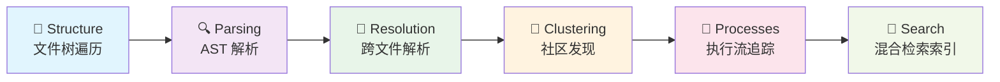
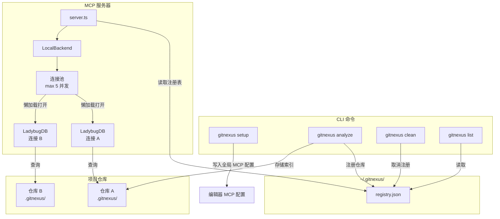
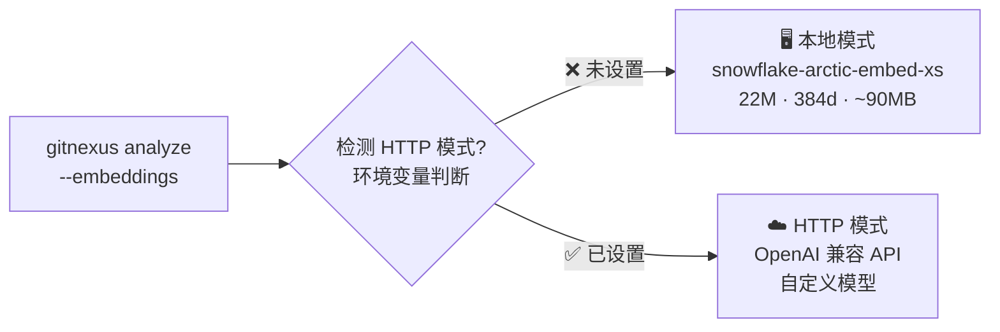
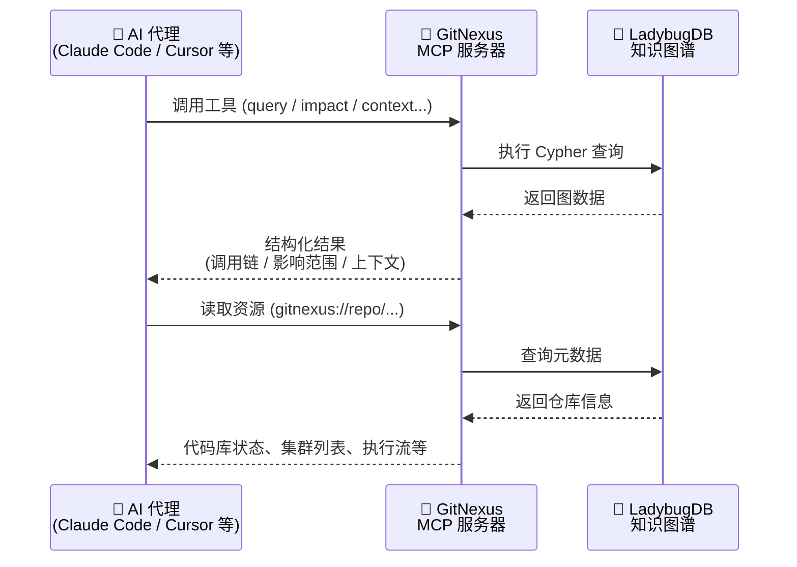
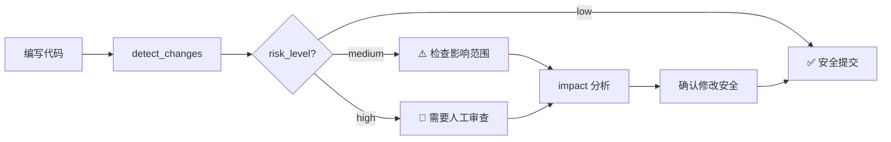
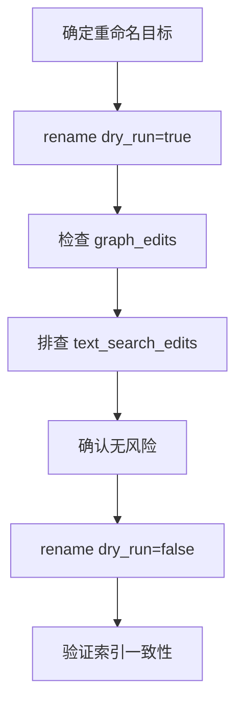

# 🌟 GitNexus 详细使用手册

> **The Zero-Server Code Intelligence Engine — 零服务端代码智能引擎**
> 为 AI 代理构建代码知识的"神经系统"，让每一次代码编辑都不再盲目。

***

## 📖 目录

*   [一、项目概览](#一项目概览)
*   [二、核心架构](#二核心架构)
*   [三、CLI 使用指南](#三cli-使用指南)
    *   [3.5 向量嵌入模型配置](#35-向量嵌入模型配置)
*   [四、MCP 使用指南](#四mcp-使用指南)
*   [五、MCP 工具详解](#五mcp-工具详解)
*   [六、Web UI 使用](#六web-ui-使用)
*   [七、Docker 部署](#七docker-部署)
*   [八、实战场景](#八实战场景)
*   [九、环境变量参考](#九环境变量参考)
*   [十、常见问题与排错](#十常见问题与排错)

***

## 一、项目概览

### 🎯 GitNexus 是什么？

GitNexus 是一个**客户端知识图谱引擎**，它能将任何代码库索引为知识图谱——追踪每一个依赖、调用链、功能集群和执行流——然后通过智能工具暴露给 AI 代理，让 AI 永远不会遗漏代码上下文。

💡 **核心价值比喻**：如果说 DeepWiki 帮你"理解"代码，那 GitNexus 帮你"分析"代码——因为知识图谱追踪的是每一层关系，而不仅仅是描述。

### 🆚 两种使用方式总览

| 维度       | **CLI + MCP** ★推荐                      | **Web UI**                                                |
| -------- | -------------------------------------- | --------------------------------------------------------- |
| **用途**   | 本地索引仓库，通过 MCP 连接 AI 代理                 | 浏览器内可视化图谱 + AI 对话                                         |
| **适用场景** | 日常开发（Cursor / Claude Code / Codex 等集成） | 快速探索、演示、一次性分析                                             |
| **规模**   | 任意大小的完整仓库                              | 浏览器内存限制（\~5k 文件），后端模式无限制                                  |
| **安装**   | `npm install -g gitnexus`              | 无需安装 → [gitnexus.vercel.app](https://gitnexus.vercel.app) |
| **存储**   | LadybugDB 原生（快速、持久化）                   | LadybugDB WASM（内存中、会话级）                                   |
| **解析**   | Tree-sitter 原生绑定                       | Tree-sitter WASM                                          |
| **隐私**   | 完全本地，无网络调用                             | 完全浏览器端，无服务器                                               |

> 🔗 **桥接模式**：`gitnexus serve` 可将两者连通——Web UI 自动检测本地服务器，直接浏览所有 CLI 索引的仓库，无需重新上传或重新索引。

***

## 二、核心架构

### 🧠 索引管线流水线

GitNexus 通过多阶段索引管线，将代码库构建为完整的知识图谱：



| 阶段             | 说明                                      |
| -------------- | --------------------------------------- |
| **Structure**  | 遍历文件树，映射文件夹/文件关系                        |
| **Parsing**    | 使用 Tree-sitter AST 提取函数、类、方法、接口         |
| **Resolution** | 解析导入、函数调用、继承、构造函数推断、`self`/`this` 接收者类型 |
| **Clustering** | 使用 Leiden 社区发现算法将相关符号分组为功能社区            |
| **Processes**  | 从入口点追踪执行流，贯穿调用链                         |
| **Search**     | 构建混合检索索引（BM25 + 语义搜索 + RRF 融合）          |

### 🏗️ 多仓库 MCP 架构



**工作原理**：每次 `gitnexus analyze` 将索引存储在仓库内的 `.gitnexus/` 目录（可移植、已 gitignore），并在 `~/.gitnexus/registry.json` 注册指针。AI 代理启动时，MCP 服务器读取注册表即可服务任何已索引的仓库。LadybugDB 连接在首次查询时懒加载打开，5 分钟不活跃后逐出（最大 5 个并发连接）。

***

## 三、CLI 使用指南

### 3.1 安装

```bash
# 全局安装（推荐）
npm install -g gitnexus

# 或通过 npx 免安装使用
npx gitnexus@latest --help
```

💡 **提速技巧**：如果你的机器没有 C++ 工具链，可以跳过可选语法树的编译：

```bash
GITNEXUS_SKIP_OPTIONAL_GRAMMARS=1 npm install -g gitnexus
```

> 设置后 Dart / Proto / Swift 文件不会被解析，但安装速度从分钟级降到秒级。

### 3.2 一键上手（Quick Start）

```bash
# 1️⃣ 在仓库根目录执行索引
cd /your/project
npx gitnexus analyze

# 2️⃣ 一键配置 MCP（自动检测已安装的编辑器）
npx gitnexus setup
```

✅ `analyze` 一条命令完成：

*   索引代码库
*   安装代理技能（Agent Skills）
*   注册 Claude Code Hooks
*   创建 `AGENTS.md` / `CLAUDE.md` 上下文文件

### 3.3 核心命令详解

#### 📦 `gitnexus analyze` — 索引仓库

```bash
gitnexus analyze [path]          # 索引指定路径（默认当前目录）
```

**常用选项**：

| 选项                               | 说明                                                         | 示例                                                |
| -------------------------------- | ---------------------------------------------------------- | ------------------------------------------------- |
| `--force`                        | 强制全量重新索引（重新解析 + 图重建 + FTS 重建）                              | `gitnexus analyze --force`                        |
| `--repair-fts`                   | 仅修复/验证全文搜索索引（不重新解析）                                        | `gitnexus analyze --repair-fts`                   |
| `--skills`                       | 检测代码社区并生成仓库级技能文件                                           | `gitnexus analyze --skills`                       |
| `--skip-embeddings`              | 跳过向量嵌入生成（更快）                                               | `gitnexus analyze --skip-embeddings`              |
| `--embeddings [limit]`           | 启用向量嵌入（更慢，搜索效果更好）。可选 `[limit]` 覆盖 50,000 节点安全上限；传 `0` 禁用上限 | `gitnexus analyze --embeddings`                   |
| `--drop-embeddings`              | 重建时丢弃已有嵌入向量（默认 `analyze` 不带 `--embeddings` 时会保留已有向量）       | `gitnexus analyze --embeddings --drop-embeddings` |
| `--embedding-threads <n>`        | 本地 ONNX 推理线程数                                              | `--embedding-threads 4`                           |
| `--embedding-batch-size <n>`     | 每批处理的节点数                                                   | `--embedding-batch-size 32`                       |
| `--embedding-sub-batch-size <n>` | 每次模型调用的 chunk 数                                            | `--embedding-sub-batch-size 16`                   |
| `--embedding-device <device>`    | 推理设备：`auto` / `cpu` / `cuda` / `dml` / `wasm`              | `--embedding-device dml`                          |
| `--skip-agents-md`               | 保留自定义 AGENTS.md/CLAUDE.md 编辑                               | `gitnexus analyze --skip-agents-md`               |
| `--skip-git`                     | 索引非 Git 仓库的文件夹                                             | `gitnexus analyze --skip-git`                     |
| `--verbose`                      | 打印被跳过的文件详情                                                 | `gitnexus analyze --verbose`                      |
| `--workers <n>`                  | 解析工作池大小（默认 CPU-1，上限 16）                                    | `gitnexus analyze --workers 8`                    |
| `--worker-timeout 60`            | 工作线程空闲超时（秒）                                                | `gitnexus analyze --worker-timeout 60`            |

#### ⚙️ `gitnexus setup` — 配置 MCP

```bash
gitnexus setup    # 自动检测已安装的编辑器并写入全局 MCP 配置（仅需运行一次）
```

#### 🔌 `gitnexus mcp` — 启动 MCP 服务器

```bash
gitnexus mcp      # 以 stdio 模式启动 MCP 服务器，服务所有已索引仓库
```

#### 🌐 `gitnexus serve` — 启动 HTTP 服务器

```bash
gitnexus serve    # 启动本地 HTTP 服务器（多仓库），供 Web UI 连接
# Web UI 会自动检测并连接本地服务器
```

#### 📋 `gitnexus list` / `gitnexus status`

```bash
gitnexus list     # 列出所有已索引的仓库
gitnexus status   # 显示当前仓库的索引状态（是否过期等）
```

#### 🧹 `gitnexus clean`

```bash
gitnexus clean              # 删除当前仓库的索引
gitnexus clean --all --force  # 删除所有仓库的索引
```

#### 📚 `gitnexus wiki` — 生成文档 Wiki

```bash
gitnexus wiki [path]                  # 从知识图谱生成仓库文档
gitnexus wiki --model gpt-4o          # 指定 LLM 模型（默认 gpt-4o-mini）
gitnexus wiki --base-url <url>        # 自定义 LLM API 地址
gitnexus wiki --force                 # 强制全量重新生成
gitnexus wiki --lang chinese          # 指定输出语言
gitnexus wiki --timeout 120           # LLM 请求超时（秒）
gitnexus wiki --retries 5             # 最大重试次数
```

> 🐞 注意：Wiki 生成需要 LLM API 密钥（如 `OPENAI_API_KEY`）。

#### 👥 `gitnexus group` — 仓库组管理（多仓库/微服务）

```bash
gitnexus group create <name>                                    # 创建仓库组
gitnexus group add <group> <groupPath> <registryName>          # 添加仓库到组
gitnexus group remove <group> <groupPath>                       # 从组中移除仓库
gitnexus group list [name]                                      # 列出所有组 / 查看某组详情
gitnexus group sync <name>                                      # 提取契约并跨仓库匹配
gitnexus group contracts <name>                                 # 查看提取的契约和交叉引用
gitnexus group query <name> <query>                             # 跨仓库搜索执行流
gitnexus group status <name>                                    # 检查组内仓库的新鲜度
```

**参数说明**：

*   `<groupPath>`：层级路径，如 `hr/hiring/backend`
*   `<registryName>`：仓库在注册表中的名称（通过 `gitnexus list` 查看）

#### 📤 `gitnexus publish` — 发布到 understand-quickly 注册表（可选）

```bash
gitnexus publish    # 需要 UNDERSTAND_QUICKLY_TOKEN 环境变量
```

### 3.4 支持的编程语言

| 语言         |  导入 | 命名绑定 |  导出 |  继承 | 类型标注 | 构造推断 |  配置 |  框架 | 入口点 |
| ---------- | :-: | :--: | :-: | :-: | :--: | :--: | :-: | :-: | :-: |
| Python     |  ✓  |   ✓  |  ✓  |  ✓  |   ✓  |   ✓  |  ✓  |  ✓  |  ✓  |
| TypeScript |  ✓  |   ✓  |  ✓  |  ✓  |   ✓  |   ✓  |  ✓  |  ✓  |  ✓  |
| JavaScript |  ✓  |   ✓  |  ✓  |  ✓  |   —  |   ✓  |  ✓  |  ✓  |  ✓  |
| Java       |  ✓  |   ✓  |  ✓  |  ✓  |   ✓  |   ✓  |  —  |  ✓  |  ✓  |
| Kotlin     |  ✓  |   ✓  |  ✓  |  ✓  |   ✓  |   ✓  |  —  |  ✓  |  ✓  |
| C#         |  ✓  |   ✓  |  ✓  |  ✓  |   ✓  |   ✓  |  ✓  |  ✓  |  ✓  |
| Go         |  ✓  |   —  |  ✓  |  ✓  |   ✓  |   ✓  |  ✓  |  ✓  |  ✓  |
| Rust       |  ✓  |   ✓  |  ✓  |  ✓  |   ✓  |   ✓  |  —  |  ✓  |  ✓  |
| PHP        |  ✓  |   ✓  |  ✓  |  —  |   ✓  |   ✓  |  ✓  |  ✓  |  ✓  |
| Ruby       |  ✓  |   —  |  ✓  |  ✓  |   —  |   ✓  |  —  |  ✓  |  ✓  |
| Swift      |  —  |   —  |  ✓  |  ✓  |   ✓  |   ✓  |  ✓  |  ✓  |  ✓  |
| C          |  —  |   —  |  ✓  |  —  |   ✓  |   ✓  |  —  |  ✓  |  ✓  |
| C++        |  —  |   —  |  ✓  |  ✓  |   ✓  |   ✓  |  —  |  ✓  |  ✓  |
| Dart       |  ✓  |   —  |  ✓  |  ✓  |   ✓  |   ✓  |  —  |  ✓  |  ✓  |

### 3.5 向量嵌入模型配置

`--embeddings` 参数用于启用语义搜索能力，GitNexus 支持**两种嵌入模式**：



#### 📌 模式一：本地嵌入（默认）

**默认模型**：`Snowflake/snowflake-arctic-embed-xs`

| 属性   | 值                                         |
| ---- | ----------------------------------------- |
| 参数量  | 22M                                       |
| 向量维度 | 384 维                                     |
| 模型体积 | \~90MB                                    |
| 底层引擎 | `@huggingface/transformers`（ONNX Runtime） |

**本地模式可调参数**：

| CLI 参数                           | 环境变量                                | 默认值    | 说明              |
| -------------------------------- | ----------------------------------- | ------ | --------------- |
| `--embedding-threads <n>`        | `GITNEXUS_EMBEDDING_THREADS`        | CPU 核数 | ONNX 推理线程数      |
| `--embedding-batch-size <n>`     | `GITNEXUS_EMBEDDING_BATCH_SIZE`     | `16`   | 每批处理的节点数        |
| `--embedding-sub-batch-size <n>` | `GITNEXUS_EMBEDDING_SUB_BATCH_SIZE` | `8`    | 每次模型调用的 chunk 数 |
| `--embedding-device <device>`    | `GITNEXUS_EMBEDDING_DEVICE`         | `auto` | 推理设备            |

**设备选择逻辑**（`auto` 模式自动探测）：

| 系统          | 探测顺序              | 说明                                                          |
| ----------- | ----------------- | ----------------------------------------------------------- |
| **Linux**   | `cuda` → `cpu`    | 自动检测 CUDA 库（`libcublasLt.so.12`），有则用 GPU                    |
| **Windows** | `dml`（需指定）→ `cpu` | DirectML 利用 DirectX12 GPU 加速，需手动指定 `--embedding-device dml` |
| **无 GPU**   | `cpu`             | 纯 CPU 推理，速度较慢                                               |
| **兼容模式**    | `wasm`            | 最慢但兼容性最好                                                    |

💡 **HuggingFace 镜像**：本地模式首次运行需下载模型，网络不通时配置镜像：

```bash
# Linux/macOS
export HF_ENDPOINT="https://hf-mirror.com"
gitnexus analyze --embeddings

# Windows PowerShell
$env:HF_ENDPOINT = "https://hf-mirror.com"
gitnexus analyze --embeddings
```

⚠️ **当前本地模式不支持更换模型**，默认锁定 `snowflake-arctic-embed-xs`。如需使用其他向量模型，请切换到 HTTP 模式。

#### 📌 模式二：HTTP 远程嵌入（自定义模型）

通过环境变量配置 OpenAI 兼容的嵌入 API，**可自由选择任意向量模型** 🚀

**必需环境变量**：

| 环境变量                       | 说明                            | 示例                          |
| -------------------------- | ----------------------------- | --------------------------- |
| `GITNEXUS_EMBEDDING_URL`   | 嵌入 API 基础地址（不含 `/embeddings`） | `https://api.openai.com/v1` |
| `GITNEXUS_EMBEDDING_MODEL` | 模型名称                          | `text-embedding-3-small`    |

**可选环境变量**：

| 环境变量                         | 说明     | 默认值            |
| ---------------------------- | ------ | -------------- |
| `GITNEXUS_EMBEDDING_API_KEY` | API 密钥 | `"unused"`     |
| `GITNEXUS_EMBEDDING_DIMS`    | 输出向量维度 | `384`（与本地模型对齐） |

**配置示例**：

🔗 **OpenAI 官方**：

```bash
# Linux/macOS
export GITNEXUS_EMBEDDING_URL="https://api.openai.com/v1"
export GITNEXUS_EMBEDDING_MODEL="text-embedding-3-small"
export GITNEXUS_EMBEDDING_API_KEY="sk-xxxxx"
export GITNEXUS_EMBEDDING_DIMS="1536"
gitnexus analyze --embeddings
```

```powershell
# Windows PowerShell
$env:GITNEXUS_EMBEDDING_URL = "https://api.openai.com/v1"
$env:GITNEXUS_EMBEDDING_MODEL = "text-embedding-3-small"
$env:GITNEXUS_EMBEDDING_API_KEY = "sk-xxxxx"
$env:GITNEXUS_EMBEDDING_DIMS = "1536"
gitnexus analyze --embeddings
```

🦙 **本地 Ollama**：

```bash
export GITNEXUS_EMBEDDING_URL="http://localhost:11434/v1"
export GITNEXUS_EMBEDDING_MODEL="nomic-embed-text"
export GITNEXUS_EMBEDDING_DIMS="768"
gitnexus analyze --embeddings
```

🇨🇳 **国内大模型平台（智谱 / 月之暗面等）**：

```bash
# 智谱 AI
export GITNEXUS_EMBEDDING_URL="https://open.bigmodel.cn/api/paas/v4"
export GITNEXUS_EMBEDDING_MODEL="embedding-3"
export GITNEXUS_EMBEDDING_API_KEY="your-api-key"
export GITNEXUS_EMBEDDING_DIMS="2048"
gitnexus analyze --embeddings
```

🔗 **其他 OpenAI 兼容平台（如 Silicon Flow、DeepSeek 等）**：

```bash
export GITNEXUS_EMBEDDING_URL="https://api.siliconflow.cn/v1"
export GITNEXUS_EMBEDDING_MODEL="BAAI/bge-m3"
export GITNEXUS_EMBEDDING_API_KEY="your-api-key"
export GITNEXUS_EMBEDDING_DIMS="1024"
gitnexus analyze --embeddings
```

#### ⚠️ 嵌入注意事项

1.  **维度一致性**：索引时和查询时的向量维度**必须一致**，否则报错。HTTP 模式设置 `GITNEXUS_EMBEDDING_DIMS` 后，会在请求体中传入 `dimensions` 字段——支持 **Matryoshka 截断**的模型（如 OpenAI `text-embedding-3-*`、Cohere `embed-v3`）会返回截断后的向量；不支持此字段的模型可能会忽略或报 400 错误。**如果你的模型不支持 Matryoshka 参数，请不要设置 `GITNEXUS_EMBEDDING_DIMS`**。

2.  **已有向量保留**：默认情况下，不带 `--embeddings` 运行 `analyze` 会**保留已有嵌入向量**。如需清除重新生成：

    ```bash
    gitnexus analyze --embeddings --drop-embeddings
    ```

3.  **安全上限**：`--embeddings` 默认有 **50,000 节点**的安全上限，超过则跳过嵌入生成。可通过以下方式自定义：

    ```bash
    gitnexus analyze --embeddings 100000   # 自定义上限
    gitnexus analyze --embeddings 0        # 禁用上限（索引全部节点）
    ```

4.  **维度不匹配报错修复**：如果切换了模型但忘记更新维度，GitNexus 会报明确的错误信息，提示你设置正确的 `GITNEXUS_EMBEDDING_DIMS` 值。

***

## 四、MCP 使用指南

### 4.1 MCP 是什么？

MCP（Model Context Protocol）是大模型与外部工具通信的标准协议。GitNexus 的 MCP 服务器将代码知识图谱暴露为 AI 代理可调用的工具和资源，让 AI 获得对代码库的**深度架构感知**。



### 4.2 编辑器 MCP 配置

#### ★ 推荐：自动配置

```bash
gitnexus setup    # 自动检测编辑器，写入全局 MCP 配置
```

#### 手动配置各编辑器

**Claude Code**（最深集成：MCP + 技能 + Hooks）：

```bash
# macOS / Linux
claude mcp add gitnexus -- npx -y gitnexus@latest mcp

# Windows
claude mcp add gitnexus -- cmd /c npx -y gitnexus@latest mcp
```

💡 **更快的启动方式**：全局安装后用绝对路径配置，可绕过 `npx` 的下载延迟：

```bash
npm i -g gitnexus
gitnexus setup
```

**Cursor**（`~/.cursor/mcp.json`）：

```json
{
  "mcpServers": {
    "gitnexus": {
      "command": "npx",
      "args": ["-y", "gitnexus@latest", "mcp"]
    }
  }
}
```

**Codex**（`~/.codex/config.toml`）：

```toml
[mcp_servers.gitnexus]
command = "npx"
args = ["-y", "gitnexus@latest", "mcp"]
```

**Antigravity / Gemini CLI**（`~/.gemini/antigravity/mcp_config.json`）：

```json
{
  "mcpServers": {
    "gitnexus": {
      "command": "npx",
      "args": ["-y", "gitnexus@latest", "mcp"]
    }
  }
}
```

**OpenCode**（`~/.config/opencode/config.json`）：

```json
{
  "mcp": {
    "gitnexus": {
      "type": "local",
      "command": ["gitnexus", "mcp"]
    }
  }
}
```

**Windsurf**（MCP 配置）：

```json
{
  "mcpServers": {
    "gitnexus": {
      "command": "npx",
      "args": ["-y", "gitnexus@latest", "mcp"]
    }
  }
}
```

### 4.3 MCP 配置方式详解

GitNexus 的 MCP 服务器支持两种主要配置方式，适用于不同的使用场景：

#### 📌 方式一：HTTP 模式配置

通过 HTTP 协议连接到 GitNexus 的 MCP 服务器，适用于需要远程访问或集成到已有服务的场景。

**配置示例**：

```json
{
  "mcpServers": {
    "gitnexus": {
      "type": "streamableHttp",
      "url": "http://localhost:4747/api/mcp",
      "headers": {
        "Content-Type": "application/json"
      },
      "timeout": 60000,
      "disabled": false
    }
  }
}
```

**适用场景**：
- 需要远程访问 MCP 服务器
- 集成到现有的 HTTP 服务架构中
- 需要自定义请求头或超时设置
- 在 Docker 或容器环境中使用

**启动方式**：

```bash
# 启动 HTTP 服务器
gitnexus serve

# 服务器将监听 http://localhost:4747/api/mcp
```

#### 📌 方式二：本地命令模式配置

通过本地命令直接启动 MCP 服务器，适用于本地开发环境，性能更好且配置简单。

**配置示例**：

```json
{
  "mcpServers": {
    "gitnexus": {
      "command": "/root/.npm/node_modules/bin/gitnexus",
      "args": ["mcp"]
    }
  }
}
```

**适用场景**：
- 本地开发环境
- 需要最佳性能（避免网络开销）
- 不需要远程访问
- 使用 `gitnexus setup` 自动配置的场景

**启动方式**：

```bash
# 直接启动 MCP 服务器
gitnexus mcp

# 或通过 npx 启动（推荐）
npx gitnexus@latest mcp
```

#### 🔄 两种方式对比

| 特性 | HTTP 模式 | 本地命令模式 |
|------|-----------|------------|
| **网络要求** | 需要网络访问 | 无网络要求 |
| **性能** | 有网络开销 | 本地执行，性能最佳 |
| **配置复杂度** | 需要配置 URL、headers 等 | 只需配置 command 和 args |
| **远程访问** | 支持 | 不支持 |
| **适用环境** | 远程服务器、容器 | 本地开发 |
| **默认端口** | `4747` | N/A |
| **超时设置** | 可自定义 | 由编辑器控制 |

#### 💡 选择建议

1. **本地开发**：推荐使用本地命令模式（方式二），配置简单且性能最佳
2. **远程/容器环境**：使用 HTTP 模式（方式一），便于集成和访问
3. **自动配置**：使用 `gitnexus setup` 会自动配置本地命令模式
4. **自定义需求**：如需自定义超时、headers 等，使用 HTTP 模式

#### ⚙️ 高级配置示例

**自定义超时和重试**（HTTP 模式）：

```json
{
  "mcpServers": {
    "gitnexus": {
      "type": "streamableHttp",
      "url": "http://localhost:4747/api/mcp",
      "headers": {
        "Content-Type": "application/json",
        "Authorization": "Bearer your-token"
      },
      "timeout": 120000,
      "disabled": false
    }
  }
}
```

**使用全局安装的 GitNexus**（本地命令模式）：

```json
{
  "mcpServers": {
    "gitnexus": {
      "command": "gitnexus",
      "args": ["mcp"]
    }
  }
}
```

**使用 npx 启动**（本地命令模式）：

```json
{
  "mcpServers": {
    "gitnexus": {
      "command": "npx",
      "args": ["-y", "gitnexus@latest", "mcp"]
    }
  }
}
```

### 4.4 编辑器支持对比

| 编辑器             | MCP | 技能 (Skills) |         Hooks（自动增强）        | 支持级别     |
| --------------- | :-: | :---------: | :------------------------: | -------- |
| **Claude Code** |  ✅  |      ✅      | ✅ PreToolUse + PostToolUse | **完整**   |
| **Cursor**      |  ✅  |      ✅      |     ✅ postToolUse（手动安装）    | **完整**   |
| **Antigravity** |  ✅  |      ✅      |         ✅ AfterTool        | **完整**   |
| **Codex**       |  ✅  |      ✅      |              —             | MCP + 技能 |
| **Windsurf**    |  ✅  |      —      |              —             | 仅 MCP    |
| **OpenCode**    |  ✅  |      ✅      |              —             | MCP + 技能 |

> 🏆 Claude Code 获得最深集成：MCP 工具 + 代理技能 + PreToolUse Hooks（用图谱上下文增强搜索）+ PostToolUse Hooks（提交后自动检测过期索引并提示重新索引）。

### 4.5 MCP 资源列表

AI 代理可以读取以下资源获取即时上下文：

| 资源 URI                                  | 用途                         |
| --------------------------------------- | -------------------------- |
| `gitnexus://repos`                      | 列出所有已索引仓库（**入口，首先读取**）     |
| `gitnexus://repo/{name}/context`        | 代码库统计、新鲜度检查、可用工具           |
| `gitnexus://repo/{name}/clusters`       | 所有功能集群及内聚性得分               |
| `gitnexus://repo/{name}/cluster/{name}` | 集群成员和详情                    |
| `gitnexus://repo/{name}/processes`      | 所有执行流                      |
| `gitnexus://repo/{name}/process/{name}` | 完整执行流追踪含步骤                 |
| `gitnexus://repo/{name}/schema`         | 图谱 Schema（编写 Cypher 查询时参考） |

### 4.6 MCP 提示词模板

| 提示词             | 功能                        |
| --------------- | ------------------------- |
| `detect_impact` | 提交前变更分析——范围、受影响的执行流、风险等级  |
| `generate_map`  | 从知识图谱生成架构文档（含 Mermaid 图表） |

***

## 五、MCP 工具详解

### 🔍 `query` — 混合搜索

**功能**：按进程分组的混合搜索（BM25 + 语义搜索 + RRF 融合排序）

```javascript
query({
  query: "authentication middleware",  // 搜索关键词
  repo: "my-app"                       // 仓库名（仅一个仓库时可省略）
})
```

**返回结构**：

*   `processes` — 匹配到的执行流及优先级排序
*   `process_symbols` — 执行流中的相关符号
*   `definitions` — 匹配的类/接口/类型定义

💡 **优势**：传统搜索返回扁平列表，GitNexus 按执行流分组，直接告诉你"哪些流程涉及这个搜索"。

***

### 🔄 `context` — 360° 符号视图

**功能**：获取某个符号的完整上下文——谁来调用它、它调用了谁、参与了哪些执行流

```javascript
context({
  name: "validateUser",   // 符号名称
  repo: "my-app"           // 可选
})
```

**返回结构**：

*   `symbol` — 符号基本信息（UID、类型、文件路径、行号）
*   `incoming` — 谁引用了它（calls / imports 列表）
*   `outgoing` — 它引用了谁（calls 列表）
*   `processes` — 它参与的执行流及步骤位置

💡 **类比**：就像代码的"社交画像"——谁认识它？它认识谁？它在哪些"活动"中出现？

***

### 💥 `impact` — 影响半径分析

**功能**：爆炸半径分析，告诉你修改一个符号会影响到哪些代码，按深度和置信度分组

```javascript
impact({
  target: "UserService",       // 目标符号
  direction: "upstream",       // "upstream"（谁依赖我）或 "downstream"（我依赖谁）
  maxDepth: 3,                 // 最大追踪深度
  minConfidence: 0.8,          // 最低置信度过滤
  relationTypes: ["CALLS", "IMPORTS", "EXTENDS"],  // 关系类型过滤
  includeTests: false,         // 是否包含测试代码
  repo: "my-app"               // 可选
})
```

**返回格式**：

    TARGET: Class UserService (src/services/user.ts)

    UPSTREAM (what depends on this):
      Depth 1 (WILL BREAK):        ← 直接依赖，一定会受影响
        handleLogin [CALLS 90%] -> src/api/auth.ts:45
        handleRegister [CALLS 90%] -> src/api/auth.ts:78
      Depth 2 (LIKELY AFFECTED):   ← 间接依赖，大概率受影响
        authRouter [IMPORTS] -> src/routes/auth.ts
      Depth 3 (POSSIBLY AFFECTED): ← 更深层依赖，可能有影响
        ...

💡 **关键**：传统 RAG 要 4+ 次查询才能得出的结论，GitNexus 一次调用全部返回！

***

### 🛠️ `detect_changes` — Git Diff 影响分析

**功能**：将 Git 变更映射到受影响的符号和执行流

```javascript
detect_changes({
  scope: "all"    // "all" 或指定范围
})
```

**返回示例**：

    summary:
      changed_count: 12
      affected_count: 3
      changed_files: 4
      risk_level: medium          ← 风险等级评估

    changed_symbols: [validateUser, AuthService, ...]
    affected_processes: [LoginFlow, RegistrationFlow, ...]

💡 **最佳实践**：在提交代码前运行，提前发现潜在风险。

***

### ✏️ `rename` — 多文件协调重命名

**功能**：基于图谱 + 文本搜索的跨文件协调重命名

```javascript
rename({
  symbol_name: "validateUser",    // 当前名称
  new_name: "verifyUser",         // 新名称
  dry_run: true,                  // 试运行模式（不实际修改）
  repo: "my-app"                  // 可选
})
```

**返回示例**：

    status: success
    files_affected: 5
    total_edits: 8
    graph_edits: 6        ← 来自图谱，高置信度
    text_search_edits: 2  ← 来自文本搜索，需人工复核
    changes: [...]

⚠️ **注意**：`text_search_edits` 置信度较低，建议人工复核后再执行。

***

### 🧮 `cypher` — 原生 Cypher 图查询

**功能**：直接对 LadybugDB 执行 Cypher 查询，获取最灵活的自定义分析

```javascript
cypher({
  query: "MATCH (n) RETURN n LIMIT 10",
  repo: "my-app"       // 可选
})
```

**常用查询示例**：

```cypher
-- 查找认证模块中高置信度的调用关系
MATCH (c:Community {heuristicLabel: 'Authentication'})<-[:CodeRelation {type: 'MEMBER_OF'}]-(fn)
MATCH (caller)-[r:CodeRelation {type: 'CALLS'}]->(fn)
WHERE r.confidence > 0.8
RETURN caller.name, fn.name, r.confidence
ORDER BY r.confidence DESC

-- 查找所有入口点
MATCH (n {isEntrypoint: true})
RETURN n.name, n.filePath

-- 查找最"被依赖"的符号（热点代码）
MATCH (n)<-[r:CodeRelation {type: 'CALLS'}]-(caller)
RETURN n.name, n.filePath, count(caller) AS callerCount
ORDER BY callerCount DESC
LIMIT 10
```

💡 **提示**：先读取 `gitnexus://repo/{name}/schema` 资源了解图谱 Schema。

***

### 📦 仓库组工具（多仓库/微服务场景）

| 工具                | 功能           | 使用场景         |
| ----------------- | ------------ | ------------ |
| `group_list`      | 列出所有仓库组      | 查看当前配置       |
| `group_sync`      | 提取契约并进行跨仓库匹配 | 微服务间接口对齐     |
| `group_contracts` | 查看提取的契约和交叉引用 | 排查接口不一致      |
| `group_query`     | 跨仓库搜索执行流     | 追踪跨服务调用链     |
| `group_status`    | 检查组内仓库新鲜度    | 判断哪些仓库需要重新索引 |

***

## 六、Web UI 使用

### 6.1 在线体验

直接访问 [gitnexus.vercel.app](https://gitnexus.vercel.app)，拖入 ZIP 文件即可开始探索，无需安装。

### 6.2 本地运行

```bash
# 克隆仓库
git clone https://github.com/abhigyanpatwari/gitnexus.git

# 构建共享库
cd gitnexus/gitnexus-shared && npm install && npm run build

# 启动 Web UI
cd ../gitnexus-web && npm install && npm run dev
```

### 6.3 连接本地后端

```bash
# 在另一个终端启动后端
npx gitnexus@latest serve
```

Web UI 会自动检测本地服务器，显示所有已索引仓库，支持完整的 AI 对话功能。

***

## 七、Docker 部署

### 7.1 一键启动

```bash
docker compose up -d
```

*   服务器 → `http://localhost:4747`
*   Web UI → `http://localhost:4173`

### 7.2 挂载宿主机代码

```bash
WORKSPACE_DIR=$HOME/code docker compose up -d

# 在容器中索引仓库
docker compose exec gitnexus-server gitnexus index /workspace/my-repo
```

### 7.3 直接 docker run

```bash
# 服务器
docker run --rm -d \
  --name gitnexus-server \
  -p 4747:4747 \
  -v gitnexus-data:/data/gitnexus \
  ghcr.io/abhigyanpatwari/gitnexus:latest

# Web UI
docker run --rm -d \
  --name gitnexus-web \
  -p 4173:4173 \
  ghcr.io/abhigyanpatwari/gitnexus-web:latest
```

### 7.4 镜像地址

| 用途        | GHCR                                          | Docker Hub                     |
| --------- | --------------------------------------------- | ------------------------------ |
| CLI / 服务器 | `ghcr.io/abhigyanpatwari/gitnexus:latest`     | `akonlabs/gitnexus:latest`     |
| Web UI    | `ghcr.io/abhigyanpatwari/gitnexus-web:latest` | `akonlabs/gitnexus-web:latest` |

### 7.5 供应链安全验证

```bash
# 验证稳定版签名
cosign verify ghcr.io/abhigyanpatwari/gitnexus:1.6.2 \
  --certificate-identity-regexp '^https://github\.com/abhigyanpatwari/GitNexus/\.github/workflows/docker\.yml@refs/tags/v[0-9]+\.[0-9]+\.[0-9]+(-[a-zA-Z0-9.]+)?$' \
  --certificate-oidc-issuer https://token.actions.githubusercontent.com
```

***

## 八、实战场景

### 场景 1：提交前风险评估 🛡️



**操作流程**：

1.  编写完代码后，调用 `detect_changes`
2.  查看 `risk_level` 和 `affected_processes`
3.  如风险较高，用 `impact` 进一步分析爆炸半径
4.  确认安全后再提交

***

### 场景 2：跨模块重构 🔧



**操作流程**：

1.  用 `context` 了解符号的上下游依赖
2.  用 `rename(dry_run=true)` 预览变更
3.  仔细审查 `text_search_edits`（置信度低）
4.  确认后执行 `rename(dry_run=false)`

***

### 场景 3：理解陌生代码库 🗺️

**操作流程**：

1.  读取 `gitnexus://repos` 找到仓库
2.  读取 `gitnexus://repo/{name}/clusters` 了解功能分区
3.  读取 `gitnexus://repo/{name}/processes` 梳理核心执行流
4.  用 `query` 搜索关注的特定功能
5.  用 `context` 深入了解关键符号

***

### 场景 4：微服务契约对齐 🤝

**操作流程**：

```bash
# 1. 索引各个微服务仓库
gitnexus analyze /path/to/auth-service
gitnexus analyze /path/to/user-service
gitnexus analyze /path/to/order-service

# 2. 创建仓库组
gitnexus group create my-platform
gitnexus group add my-platform auth/backends auth-service
gitnexus group add my-platform user/core user-service
gitnexus group add my-platform order/processing order-service

# 3. 同步并提取契约
gitnexus group sync my-platform

# 4. 查看跨服务契约
gitnexus group contracts my-platform

# 5. 跨服务搜索执行流
gitnexus group query my-platform "user authentication flow"
```

***

## 九、环境变量参考

| 变量                                              | 默认值                | 说明                                               | 调整场景                      |
| ----------------------------------------------- | ------------------ | ------------------------------------------------ | ------------------------- |
| `GITNEXUS_WORKER_POOL_SIZE`                     | CPU-1（上限16）        | 解析工作池大小                                          | 受限容器、CI 或调试               |
| `GITNEXUS_PARSE_CHUNK_CONCURRENCY`              | `2`                | 并行读取文件内存的块数                                      | 大仓库的磁盘 I/O 优化             |
| `GITNEXUS_VERBOSE`                              | 未设置                | 设为 `1` 启用详细日志                                    | 调试遗漏文件问题                  |
| `GITNEXUS_MAX_FILE_SIZE`                        | `512`（KB）          | 文件大小跳过阈值                                         | 索引大型生成文件                  |
| `GITNEXUS_WORKER_SUB_BATCH_TIMEOUT_MS`          | `30000`            | 工作线程超时（毫秒）                                       | 大文件慢解析                    |
| `GITNEXUS_WAL_CHECKPOINT_THRESHOLD`             | `67108864`（64MiB）  | LadybugDB WAL 检查点阈值                              | 磁盘受限环境                    |
| `GITNEXUS_WORKER_SUB_BATCH_MAX_BYTES`           | `8388608`（8MB）     | 单次工作消息的字节预算                                      | 诊断超大文件                    |
| `GITNEXUS_SKIP_OPTIONAL_GRAMMARS`               | 未设置                | 严格 `=1` 跳过可选语法树                                  | 无 C++ 工具链环境               |
| `GITNEXUS_NO_GITIGNORE`                         | 未设置                | 跳过 .gitignore 解析                                 | 索引被 .gitignore 排除的生成代码    |
| `GITNEXUS_WORKER_MAX_RESPAWNS_PER_SLOT`         | `3`                | 工作槽最大重生次数                                        | 调整崩溃重试策略                  |
| `GITNEXUS_WORKER_CONSECUTIVE_FAILURE_THRESHOLD` | `max(3, poolSize)` | 连续崩溃触发熔断的阈值                                      | 调整熔断灵敏度                   |
| `GITNEXUS_EMBEDDING_THREADS`                    | CPU 核数             | 本地 ONNX 推理线程数                                    | GPU 推理时减小线程数避免争抢          |
| `GITNEXUS_EMBEDDING_BATCH_SIZE`                 | `16`               | 每批处理的节点数                                         | 大内存机器可调大以提升吞吐             |
| `GITNEXUS_EMBEDDING_SUB_BATCH_SIZE`             | `8`                | 每次模型调用的 chunk 数                                  | 配合 GPU 显存调整               |
| `GITNEXUS_EMBEDDING_DEVICE`                     | `auto`             | 推理设备：`auto` / `cpu` / `cuda` / `dml` / `wasm`    | Windows 用户指定 `dml` 启用 GPU |
| `GITNEXUS_EMBEDDING_URL`                        | 无                  | HTTP 嵌入 API 基础地址（需配合 `GITNEXUS_EMBEDDING_MODEL`） | 使用远程嵌入服务                  |
| `GITNEXUS_EMBEDDING_MODEL`                      | 无                  | HTTP 嵌入模型名称                                      | 使用远程嵌入服务                  |
| `GITNEXUS_EMBEDDING_API_KEY`                    | `"unused"`         | HTTP 嵌入 API 密钥                                   | 需认证的远程嵌入服务                |
| `GITNEXUS_EMBEDDING_DIMS`                       | `384`              | HTTP 嵌入输出向量维度                                    | 切换模型后需同步更新                |
| `GITNEXUS_SEMANTIC_EXACT_SCAN_LIMIT`            | `10000`            | 嵌入 chunk 精确扫描回退上限                                | 大仓库语义搜索调优                 |
| `HF_ENDPOINT`                                   | 无                  | HuggingFace 模型下载镜像地址                             | 网络受限环境使用镜像                |

> ★ CLI 参数优先级 > 环境变量 > 内置默认值

***

## 十、常见问题与排错

### 🐞 MCP 服务器启动超时

**现象**：首次使用 `npx` 启动时，下载包可能超过 MCP 的默认超时（\~30秒）。

**解决**：

```bash
# 方法一：全局安装后使用绝对路径
npm i -g gitnexus
gitnexus setup

# 方法二：预热 npx 缓存
npx gitnexus@latest --help
```

### 🐞 索引后查询结果不完整

**排查步骤**：

1.  运行 `gitnexus status` 检查索引是否过期
2.  如过期，运行 `gitnexus analyze` 更新
3.  如仍不完整，尝试 `gitnexus analyze --force` 全量重建
4.  仅搜索异常可尝试 `gitnexus analyze --repair-fts`

### 🐞 大型仓库索引慢

**优化建议**：

```bash
# 跳过嵌入向量生成（搜索精度稍降，速度大幅提升）
gitnexus analyze --skip-embeddings

# 增加并行度
gitnexus analyze --workers 8

# 减少文件大小限制（跳过更大文件）
gitnexus analyze --max-file-size 256
```

### 🐞 Windows 上的特殊注意事项

*   使用 `cmd /c` 包装 npx 命令：
    ```bash
    claude mcp add gitnexus -- cmd /c npx -y gitnexus@latest mcp
    ```
*   如遇到 C++ 编译问题，设置环境变量跳过可选语法树：
    ```bash
    set GITNEXUS_SKIP_OPTIONAL_GRAMMARS=1
    npm install -g gitnexus
    ```

### 🐞 嵌入模型下载失败 / 网络超时

**现象**：运行 `gitnexus analyze --embeddings` 时报模型下载错误。

**解决**：

```bash
# 配置 HuggingFace 镜像
export HF_ENDPOINT="https://hf-mirror.com"
gitnexus analyze --embeddings
```

如果镜像也不可用，切换到 HTTP 模式使用远程嵌入 API：

```bash
export GITNEXUS_EMBEDDING_URL="https://api.openai.com/v1"
export GITNEXUS_EMBEDDING_MODEL="text-embedding-3-small"
export GITNEXUS_EMBEDDING_API_KEY="sk-xxxxx"
gitnexus analyze --embeddings
```

### 🐞 向量维度不匹配报错

**现象**：报错 `Embedding dimension mismatch: endpoint returned Xxxd vector, but expected Yyyd`。

**原因**：切换了嵌入模型但 `GITNEXUS_EMBEDDING_DIMS` 未同步更新，或索引与查询使用了不同模型。

**解决**：

1.  查看报错信息中的提示，设置正确的维度：`export GITNEXUS_EMBEDDING_DIMS=<实际维度>`
2.  或者清除旧向量重建索引：`gitnexus analyze --embeddings --drop-embeddings`

### 🐞 GPU 加速未生效

**现象**：`--embedding-device auto` 仍在使用 CPU 推理。

**排查**：

*   **Linux CUDA**：确认安装了 CUDA 12.x 运行库（`ldconfig -p | grep libcublasLt.so.12`）
*   **Windows DirectML**：需手动指定 `--embedding-device dml`
*   **ONNX Runtime**：CUDA 支持需要 onnxruntime-node ≥ 1.24.0，旧版本为 CPU-only 构建

### 🐞 PostToolUse Hook 未触发自动重新索引

*   确认你使用的是 Claude Code（目前 Hooks 仅 Claude Code 深度支持）
*   检查 `gitnexus setup` 是否成功注册了 Hook
*   手动触发：`gitnexus analyze`

***

## 📝 总结

| 使用路径          | 最佳场景       | 一句话描述               |
| ------------- | ---------- | ------------------- |
| **CLI + MCP** | 日常 AI 辅助开发 | 让 AI 代理真正"理解"你的代码架构 |
| **Web UI**    | 快速探索、演示    | 拖入 ZIP，即刻开启可视化的代码漫游 |
| **Docker**    | 团队共享、CI/CD | 一键部署，统一管理多个仓库的知识图谱  |

🚀 **记住核心公式**：

    一次 analyze → 全局 MCP 注册 → AI 代理获得代码库深度感知

**让 AI 不再盲目编辑，让每一次改动都有据可查！**
