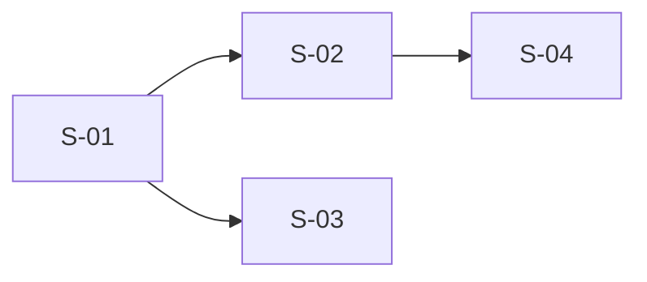
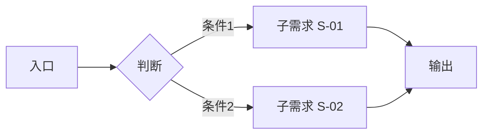

# 父文档模板（复杂需求拆分 · 全局架构层）

> 本模板由 `design-doc-generator` skill 在需求拆分场景下使用，作为父文档的骨架来源。
> 父文档聚焦全局架构、子需求边界和接口契约，不展开子需求的详细设计。
> 详细设计见各子文档（14 章完整模板参照 [TEMPLATE.md](TEMPLATE.md)）。

---

# `<功能名>` 设计文档（全局）

> - 状态：草案 / 评审中 / 已通过
> - 起草时间：YYYY-MM-DD
> - 关联子文档：
>   - [S-01 `<子需求名>`](<feature>_S01_<子需求名>_DESIGN.md)
>   - [S-02 `<子需求名>`](<feature>_S02_<子需求名>_DESIGN.md)
> - 实施范围：`<一句话限定本设计涉及的代码/模块边界>`

## 1. 需求背景 & 目标

### 1.1 背景

`<1 段：当前业务/技术现状导致的什么问题，为什么现在要做>`

### 1.2 整体目标

- 目标 1：`<可验证的描述>`
- 目标 2：`<可验证的描述>`
- 目标 3：`<可验证的描述>`

### 1.3 明确不在范围内

- `<具体到点的全局不做项 1>`
- `<具体到点的全局不做项 2>`

## 2. 名词术语表

| 术语 | 含义 | 易混淆点 |
| --- | --- | --- |
| `<术语 A>` | `<本文档中的精确含义>` | `<和某常见含义的区别>` |
| `<术语 B>` | `<...>` | `<...>` |

> 仅列出**跨子需求共享**或**高频易歧义**的术语。仅单个子需求使用的术语在该子文档中定义。

## 3. 方案设计（TO-BE）

### 3.1 整体架构

`<1~3 句话讲清楚整体方案和架构思路>`

### 3.2 子需求划分

| 编号 | 子需求 | 职责边界 | 对外接口概述 |
| ---- | ------ | -------- | ------------ |
| S-01 | `<名称>` | `<一句话职责>` | `<关键接口签名或协议>` |
| S-02 | `<名称>` | `<一句话职责>` | `<关键接口签名或协议>` |

### 3.3 子需求依赖关系



### 3.4 关键决策点

| 决策 | 选择 | 理由 | 备选 |
| --- | --- | --- | --- |
| `<决策点 1>` | `<选择>` | `<理由>` | `<被否决的方案 + 否决原因>` |

## 4. 架构图 / 流程图



> 一张图说清楚整体调用链或数据流向，标注各子需求的边界。

## 5. 模块/类设计（边界与契约）

### 5.1 子需求边界

| 子需求 | 拥有模块 | 协作接口 | 不暴露 |
| ------ | -------- | -------- | ------ |
| S-01 | `<ModuleA>` | `<method_x, method_y>` | `<内部实现>` |
| S-02 | `<ModuleB>` | `<method_z>` | `<内部实现>` |

### 5.2 跨子需求接口契约

```python
def cross_boundary_api(arg1: str, arg2: int = 0) -> Result:
    """<跨子需求调用的接口，签名级别精度>"""
```

| 接口 | 调用方 | 提供方 | 输入 | 输出 | 异常 |
| ---- | ------ | ------ | ---- | ---- | ---- |
| `cross_boundary_api` | S-02 | S-01 | `arg1, arg2` | `Result` | `ValueError` |

> 此处定义的接口签名是各子文档详细设计的围栏，子文档不得与之矛盾。

## 6. 待设计需求（分期设计场景）

> 本章节记录非当前期的子需求，供后续迭代设计时参考。无分期设计时可省略本章节。

| 编号 | 子需求 | 设计前置条件 | 计划设计时机 | 备注 |
| ---- | ------ | ------------ | ------------ | ---- |
| S-03 | `<名称>` | `<需先完成 S-01 设计，确认 XX 接口>` | `<第二期>` | ... |
| S-04 | `<名称>` | `<需先完成 S-02 设计，确认 XX 策略>` | `<第二期>` | ... |

**分期说明**：
- 第一期（当前）：S-01, S-02 → 已完成设计，见对应子文档
- 第二期（待设计）：S-03, S-04 → 待第一期设计验证后启动
- 后续每期设计完成后，更新本章节

## 7. 风险 & 待定问题

### 7.1 全局风险

| 风险 | 影响范围 | 预案 |
| --- | --- | --- |
| `<风险 1>` | `<影响哪些子需求>` | `<应对方式>` |

### 7.2 跨子需求依赖风险

| 依赖 | 风险描述 | 缓解措施 |
| ---- | -------- | -------- |
| S-02 → S-01 | `<如果 S-01 接口变更>` | `<接口版本控制 / 适配层>` |

### 7.3 待定问题（Open Questions）

- [ ] `<问题 1>`：`<需要谁/何时澄清>`
- [ ] `<问题 2>`：`<...>`
