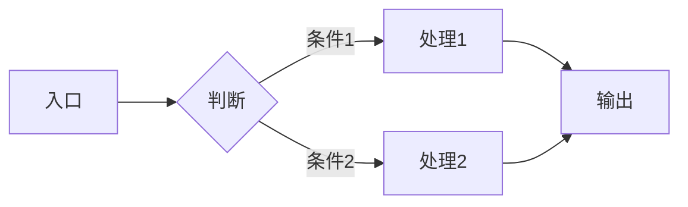
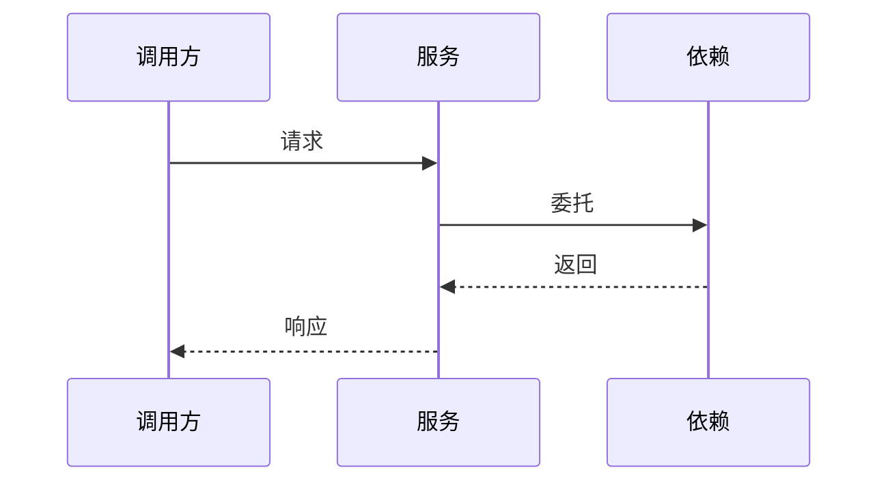

# 设计文档模板（轻量级 14 章骨架）

> 本模板由 `design-doc-generator` skill 使用，作为阶段 4 填充的骨架来源。
> 风格：结构完整、内容轻量、强调边界、图表优先。

---

# `<功能名>` 设计文档

> - 状态：草案 / 评审中 / 已通过
> - 起草时间：YYYY-MM-DD
> - 关联文档：`<可选：需求来源、上游设计、下游实施计划>`
> - 实施范围：`<一句话限定本设计涉及的代码/模块边界>`

## 1. 需求背景 & 目标

### 1.1 背景

`<1 段：当前业务/技术现状导致的什么问题，为什么现在要做>`

### 1.2 目标

- 目标 1：`<可验证的描述>`
- 目标 2：`<可验证的描述>`
- 目标 3：`<可验证的描述>`

### 1.3 明确不在范围内

- `<具体到点的不做项 1>`
- `<具体到点的不做项 2>`
- `<具体到点的不做项 3>`

## 2. 名词术语表

| 术语 | 含义 | 易混淆点 |
| --- | --- | --- |
| `<术语 A>` | `<本文档中的精确含义>` | `<和某常见含义的区别>` |
| `<术语 B>` | `<...>` | `<...>` |

> 仅列出本文档中**使用频率高或易产生歧义**的词。常识性术语不列入。

## 3. 现状分析（AS-IS）

### 3.1 现有实现

`<现状是怎样的，关键模块/链路简述>`

### 3.2 痛点

- 痛点 1：`<具体表现 + 影响>`
- 痛点 2：`<具体表现 + 影响>`

> 不写"代码不优雅"、"维护困难"等抽象描述，必须给出**具体表现**。

## 4. 方案设计（TO-BE）

### 4.1 方案概述

`<1~3 句话讲清楚整体方案>`

### 4.2 关键决策点

| 决策 | 选择 | 理由 | 备选 |
| --- | --- | --- | --- |
| `<决策点 1>` | `<选择>` | `<理由>` | `<被否决的方案 + 否决原因>` |
| `<决策点 2>` | ... | ... | ... |

### 4.3 与现状的差异

`<对照第 3 章，新方案改变了哪些点>`

## 5. 架构图 / 流程图



> 一张图说清楚整体调用链或数据流向。多张图请拆为子节。

## 6. 模块/类设计

### 6.1 模块清单

| 模块 / 类 | 职责 | 依赖 |
| --- | --- | --- |
| `<ModuleA>` | `<单一职责描述>` | `<依赖项>` |
| `<ClassB>` | `<...>` | `<...>` |

### 6.2 关键类设计要点

- `<ClassB>`：
  - 公开方法：`<method_a, method_b>`
  - 不暴露：`<内部实现细节>`
  - 设计取舍：`<例如同步 vs 异步、有状态 vs 无状态>`

## 7. 接口设计

### 7.1 对外接口

```python
def public_api(arg1: str, arg2: int = 0) -> Result:
    """<一句话功能描述>"""
```

| 接口 | 输入 | 输出 | 异常 |
| --- | --- | --- | --- |
| `public_api` | `arg1, arg2` | `Result` | `ValueError, TimeoutError` |

### 7.2 内部协作接口

`<仅在多模块协作时列出，单文件实现可省略此小节>`

## 8. 数据模型

### 8.1 持久化结构

`<表结构 / 文档结构 / 缓存键设计；无则填"不涉及持久化"，本章保留>`

### 8.2 传输/中间数据结构

```python
@dataclass
class XxxDTO:
    field_a: str
    field_b: int
```

## 9. 关键流程时序图



> 仅画**关键路径**或**容易出错的协作**。简单同步流程可写"无需时序图"。

## 10. 异常处理 & 边界情况

| 场景 | 行为 | 是否对外暴露 |
| --- | --- | --- |
| `<输入异常>` | `<抛 ValueError>` | 是 |
| `<下游超时>` | `<重试 N 次后失败>` | 是 |
| `<并发冲突>` | `<以最后写入为准>` | 否 |

## 11. 性能 & 安全考虑

### 11.1 性能

- 预期 QPS / 延迟：`<量级即可，不强求精确>`
- 关键瓶颈点：`<...>`
- 不做的优化：`<避免过度设计>`

### 11.2 安全

- 输入校验：`<...>`
- 权限边界：`<...>`
- 敏感信息处理：`<...>`

> 无明显性能 / 安全压力时填"无特殊考虑"，本章保留。

## 12. 测试方案

| 类型 | 范围 | 工具 |
| --- | --- | --- |
| 单元测试 | `<核心类/函数>` | `pytest` |
| 集成测试 | `<跨模块路径>` | `<...>` |
| 边界测试 | `<空输入/超时/并发>` | `pytest` |

不在测试范围内：

- `<不做的测试场景及理由>`

## 13. 实施计划 / 里程碑

| 批次 | 主题 | 主要产出 | 依赖 |
| --- | --- | --- | --- |
| Batch 1 | `<主题>` | `<文件清单>` | 无 |
| Batch 2 | `<主题>` | `<文件清单>` | Batch 1 |
| Batch 3 | `<主题>` | `<文件清单>` | Batch 1, 2 |

> 详细批次范围、验收标准可另行产出 `<feature>_IMPL_PLAN.md`，本章只给总览。

## 14. 风险 & 待定问题

### 14.1 已知风险

| 风险 | 影响 | 预案 |
| --- | --- | --- |
| `<风险 1>` | `<影响范围>` | `<应对方式>` |

### 14.2 待定问题（Open Questions）

- [ ] `<问题 1>`：`<需要谁/何时澄清>`
- [ ] `<问题 2>`：`<...>`
