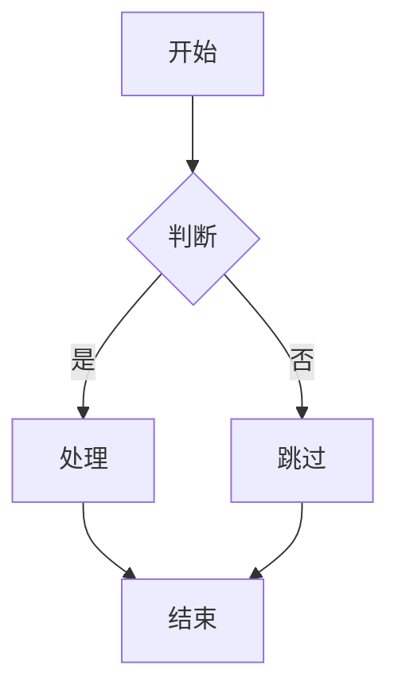
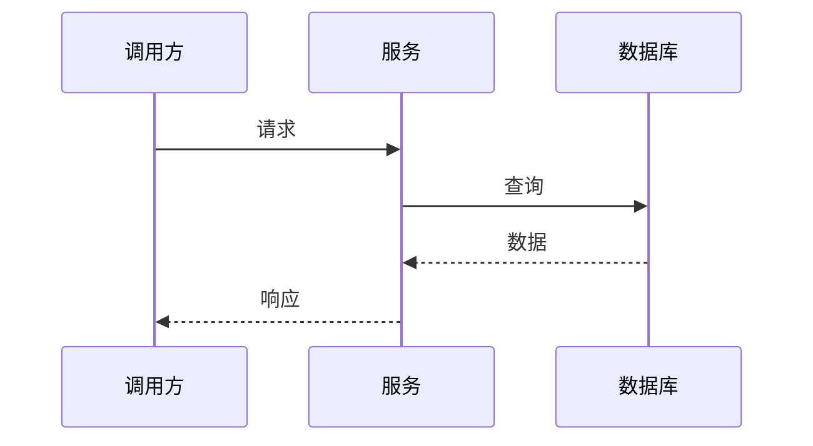
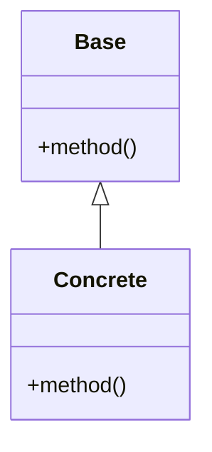
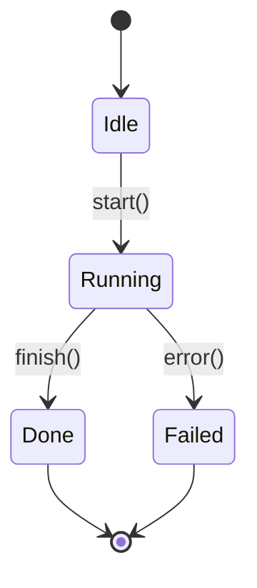

# 设计文档生成器参考资料

> 本文件为 `design-doc-generator` skill 的扩展资料，按需查阅。

---

## 一、语义分析示例

### 示例 1：模糊词 → 明确语义

**用户输入**：
> "给任务系统加一个幂等能力。"

**语义分析输出**：

```text
🧠 语义分析与场景对齐

【语义拆解】
- "幂等" 在此可能指三种不同语义：
  A. 接口幂等：同一请求重复提交，业务结果只生效一次
  B. 任务幂等：Celery 任务被重复投递/重试时，副作用只发生一次
  C. 消息幂等：消息中间件 at-least-once 语义下的去重
- "任务系统" 推断为 Celery（基于现有 ab_celery 模块）
  → 倾向于 B

【场景匹配】
| 子需求 | 触发场景 | 使用主体 | 解决痛点 |
| ----- | ------- | ------- | ------- |
| 任务幂等 | worker 异常重试 / broker 重投 | 后台任务作者 | 副作用重复执行 |

【价值判定】
- ⚠️ 存疑点 1：你们的任务是否本身已天然幂等（纯查询/UPSERT）？
  若是，则需求 ❌ 无价值，建议改为"梳理任务幂等性清单"。
- ⚠️ 存疑点 2：是否所有任务都需要，还是仅关键任务？
  全量引入会带来 Redis 依赖与额外延迟。

请回答：
1. "幂等" 是 A / B / C 哪种？
2. 现有任务里大约多少比例存在非幂等副作用？
3. 是否接受"只对标记过的任务启用"这种粒度？
```

### 示例 2：场景不成立 → 主动劝退

**用户输入**：
> "给我们的内部脚本工具加一个限流能力。"

**语义分析输出（节选）**：

```text
【价值判定】
- ❌ 子需求"限流"：场景不成立
  - 理由：内部脚本工具调用方为开发者本人，QPS 极低
  - 限流的成本（额外配置 + 误触发）高于收益
  - 建议替代方案：
    1. 加一个简单的全局开关 / 防呆 confirm
    2. 在被调用的下游服务侧做限流（更合理的位置）

是否仍坚持要做？若坚持，请补充触发限流的真实场景。
```

### 示例 3：用户回答"按你判断"

**正确处理**：

```text
收到。我将采纳以下解释推进：
- "幂等" = 任务幂等（语义 B）
- 粒度 = 仅对标记过的任务启用
- 去重存储 = Redis（已有依赖）

如以上推断与你的预期不符，请在阶段 3（大纲）确认时纠正。
进入阶段 3。
```

不要在用户说"按你判断"后什么也不说就跳到下一阶段。

### 示例 4：用户在后续阶段修改需求（迭代修改）

**场景**：用户在阶段 4（分章节填充）时发现需求理解有误，需要回退。

**用户输入**（在阶段 4 填充第 6 章时）：
> "等等，我之前说的'幂等'其实不只是任务幂等，我还希望接口层也能防重提交。"

**正确处理**：

```text
🔄 需求变更 — 回退到阶段 2 重新对齐

【变更内容】
- 原语义："幂等" = 任务幂等（语义 B）
- 新增语义："幂等" = 任务幂等（语义 B）+ 接口幂等（语义 A）

【影响评估】
- 第 4 章"方案设计"：需增加接口层防重方案（如：唯一请求ID + Redis 去重）
- 第 5 章"架构图"：需增加接口层拦截节点
- 第 7 章"接口设计"：接口签名需增加 request_id 参数
- 第 9 章"时序图"：需增加接口层防重时序
- 其余章节不受影响

【处理方式】
- 已填充的第 1~3 章内容保留不变（语义拆解已更新，但历史判定记录保留）
- 从第 4 章开始，按更新后的语义重新填充
- 不需要从阶段 1 重新开始

请确认以上变更，或补充遗漏的影响点。
```

**关键原则**：
- 回退到语义变更发生的**前一个阶段**（本例中回退到阶段 2，而非阶段 1）
- 已确认且不受影响的内容**保留**，避免重复劳动
- 明确列出**影响范围**，不要笼统地说"从头改起"
- 不要拒绝用户的变更请求，也不要假装没有变更直接继续

---

## 二、常见歧义词速查

| 词 | 可能语义 |
| --- | --- |
| 幂等 | 接口幂等 / 任务幂等 / 消息幂等 |
| 缓存 | 进程内 / 分布式 / 浏览器侧 / CDN |
| 异步 | 线程 / 协程 / 消息队列 / 定时任务 |
| 重试 | 客户端 / 服务端补偿 / 中间件重投 |
| 限流 | 单机 / 全局 / 用户维度 / 接口维度 |
| 通知 | 推送 / 邮件 / 站内信 / Webhook |
| 锁 | 进程锁 / 线程锁 / 分布式锁 / 乐观锁 |
| 事务 | 数据库事务 / 业务事务 / 分布式事务 |
| 监控 | 日志 / 指标 / 链路追踪 / 健康检查 |
| 配置 | 启动参数 / 环境变量 / 配置文件 / 配置中心 |
| 鉴权 | 认证 / 授权 / 鉴别身份 / 校验权限 |
| 优化 | 性能 / 可读性 / 资源占用 / 部署成本 |
| 重构 | 内部重写 / 接口调整 / 拆分合并 |
| 扩展 | 加配置项 / 加新模块 / 加新接口 / 加插件机制 |

遇到这些词时**必须**进行语义拆解。

---

## 三、章节写作要点

### 第 1 章 需求背景 & 目标

- 背景写**触发设计的具体事件**，不写"为了更好地..."的空话
- 目标必须**可验证**：能用一句话回答"做完后如何判断达成"
- "不在范围内"必须**具体到点**

### 第 2 章 名词术语表

- 只列**易混 / 高频**的词，常识词不列
- 每条术语标注"和某常见含义的区别"

### 第 3 章 现状分析

- 痛点必须有**具体表现**（错误日志？性能数据？维护成本？）
- 不写"代码不优雅"这类抽象描述

### 第 4 章 方案设计

- 方案概述 ≤ 3 句话
- 关键决策点表格中**必须**写"被否决的方案 + 否决原因"

### 第 5 章 架构图

- 一张图原则。复杂系统拆为子节，每子节一张图
- 优先 `flowchart`，避免过度装饰

### 第 6 章 模块/类设计

- 每个模块/类只写**职责一句话**，不写实现细节
- 强调"不暴露什么"

### 第 7 章 接口设计

- 给出**真实可用的函数签名**，不是伪代码
- 异常列入接口契约

### 第 8 章 数据模型

- 无持久化时写"不涉及持久化"，**保留章节**
- DTO / 中间结构有变化也要列出

### 第 9 章 时序图

- 仅画**关键路径**或**易出错的协作**
- 简单同步流程写"无需时序图"

### 第 10 章 异常处理

- 异常表必须包含"是否对外暴露"列
- 边界情况包括：空输入 / 超时 / 并发 / 资源耗尽 / 部分失败

### 第 11 章 性能 & 安全

- 没有压力时写"无特殊考虑"，不要硬凑
- 显式声明"不做的优化"，对抗过度设计

### 第 12 章 测试方案

- 必须包含"不做的测试"
- 集成测试和单测分开列

### 第 13 章 实施计划

- 本章只给**总览表**
- 详细批次另起 `<feature>_IMPL_PLAN.md`（参考现有 `COMMON_CELERY_IMPL_PLAN.md` 风格）

### 第 14 章 风险 & 待定问题

- 风险必须有**预案**，没有预案的不算风险
- 待定问题用 `[ ]` 标记，方便后续追踪

---

## 四、Mermaid 速查

### 流程图



### 时序图



### 类关系图



### 状态图



---

## 五、反模式清单

### 设计文档常见反模式

- ❌ "众所周知"、"显而易见"、"业界通用做法" → 删除
- ❌ "为了更好地服务用户" → 改为可验证的目标
- ❌ 把 README 当设计文档（只讲怎么用，不讲为什么这样设计）
- ❌ 把会议纪要当设计文档（流水账记录，无方案权衡）
- ❌ 复制需求 PRD 大段原文 → 应做语义提炼
- ❌ 章节内容堆砌占位（"暂无"、"略"）→ 应明确写"不涉及"或删除子节
- ❌ 没有"不在范围内" → 必有

### 语义分析阶段反模式

- ❌ 用户给出歧义词后，未拆解直接进入设计
- ❌ 反问太空（"能详细说说吗"）→ 必须二选一/三选一
- ❌ 用户说"按你判断"后静默推进 → 必须显式声明采纳的解释
- ❌ 出现 ❌ 子需求时硬写设计 → 必须先劝退
